## 个人工作概览
| 时间 | 工作 |
|---|---|
| 第4周 | 海洋环境搭建；尝试编写脚本实现小船物理 |
| 第5周 | 调整小船浮力和动力系统，基本实现正常物理反馈 |
| 第6周 | 使用开源脚本调整小船浮力物理效果 |
| 第7周 | 复现开源项目BoatAttack；尝试导入天气系统插件 |
| 第8-10周 | 修改Water组件实现简单海况改变的调试 |
| 第11周 | 尝试随机地形方向发现不可行；学习AI小船自动寻路实现原理 |
| 第12-13周 | 解决编辑器兼容性导致无法打开项目的问题 |
| 第14周 | 搭建第二条赛道demo场景 |
| 第15周 | 完成Pirate赛道正式场景搭建；修改Pyramid赛道场景；编写BGM控制脚本并新增BGM |
| 第16-17周 | 项目收尾，调整小地图显示 |
| 第18周 | ppt制作、汇报与个人工作总结 |

## 6.26
整个项目二次开发已基本完成，实现了天气系统、相应海况与小船物理优化、新增两条赛道、BGM新增与修改以及UI主菜单修改。最后阶段协助组员调整游戏过程中的小地图显示修改，但最终导出为游戏文件并运行时无法显示修改后的小地图视角，有待后续解决。

## 6.12
完成了第二个赛道场景Pirate的正式游戏场景制作，同时修改了组员制作的第三个赛道场景Pyramid，调整光照、天空盒与赛道中的目标点位，并重新烘焙地图使AI可自动寻路。
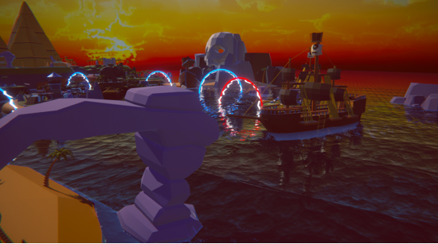
编写BGM控制脚本BGMManager.cs，根据新增场景风格增加了新的BGM，设定为识别到场景改变时改为播放对应BGM。
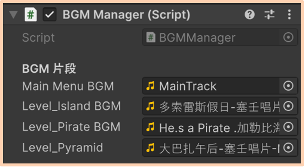

```C#
using UnityEngine;
using UnityEngine.SceneManagement;

public class BGMManager : MonoBehaviour
{
    public static BGMManager Instance;

    [Header("BGM 片段")]
    public AudioClip mainMenuBGM;   // 主菜单
    public AudioClip level_IslandBGM;     // 关卡1
    public AudioClip level_PirateBGM;     // 关卡2
    public AudioClip level_Pyramid;     // 按需添加更多

    private AudioSource audioSource;
    private string currentSceneName;

    void Awake()
    {
        // 单例模式，确保只有一个实例
        if (Instance == null)
        {
            Instance = this;
            DontDestroyOnLoad(gameObject);  // 切换场景时不销毁
        }
        else
        {
            Destroy(gameObject);
            return;
        }

        audioSource = GetComponent<AudioSource>();
        if (audioSource == null)
            audioSource = gameObject.AddComponent<AudioSource>();

        audioSource.loop = true;  // 循环播放
    }

    void OnEnable()
    {
        // 订阅场景加载事件
        SceneManager.sceneLoaded += OnSceneLoaded;
    }

    void OnDisable()
    {
        SceneManager.sceneLoaded -= OnSceneLoaded;
    }

    void OnSceneLoaded(Scene scene, LoadSceneMode mode)
    {
        // 切换场景时调用
        string newSceneName = scene.name;
        if (newSceneName == currentSceneName) return;

        currentSceneName = newSceneName;
        PlayBGMForScene(newSceneName);
    }

    void PlayBGMForScene(string sceneName)
    {
        AudioClip targetClip = null;

        // 根据场景名称选择 BGM
        switch (sceneName)
        {
            case "Main_Menu":
                targetClip = mainMenuBGM;
                break;
            case "level_Island":
                targetClip = level_IslandBGM;
                break;
            case "level_Pirate":
                targetClip = level_PirateBGM;
                break;
            case "level_Pyramid":
                targetClip = level_Pyramid;
                break;
            default:
                targetClip = mainMenuBGM; // 默认音乐
                break;
        }

        if (targetClip == null) return;

        // 如果音乐没变，不重启
        if (audioSource.clip == targetClip && audioSource.isPlaying)
            return;

        audioSource.clip = targetClip;
        audioSource.Play();
    }
}
```

## 6.5
本周进行第二个赛道场景搭建。在模型网站上找到了合适的海岛场景模型（暗黑海盗湾风格）并导入项目，将原赛道demo场景复制以保留所有逻辑，替换其中的模型、特效、光照与天空盒，使场景整体风格协调，同时按照新模型位置规划并调整赛道区域和目标点位，重新烘焙地图使AI小船可以识别新的可行区域。所有修改均在复制的demo场景中实现并能正常运行，之后将按相同方式复制正式游戏场景并调整。
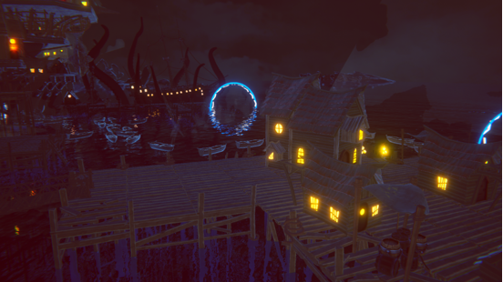

## 5.29
因为编辑器版本兼容性问题，使用原本的团结引擎1.8.4无法正常打开项目，出现多项报错。和组员多次尝试后，最终使用海外版Unity Hub安装Unity 6.4解决了这一问题，项目可以正常打开并运行。

## 5.15
尝试拓展新方向——随机地形生成，经过学习后发现一般多用Perlin噪声实现随机地形，但这种方式生成地形再找河流往往会得到断头河或不规则沼泽，并不适合作为竞速赛道，另外也未找到合适且成熟的程序化生成方式。后续会尝试手动制作新的赛道场景，结合UI达到可以在多条赛道中进行选择的效果。
同时还学习了项目中AI小船实现自动寻路的方法。借助NavMesh工具，将和海面同一高度的不可见平面设定为地图平面，结合场景中一定范围内的模型和地形进行烘焙得到AI小船可行走区域（图中的蓝色区域），并且沿预设赛道手动设定多个目标点位，AI小船就会从起点开始沿赛道经过每个点位到达终点。
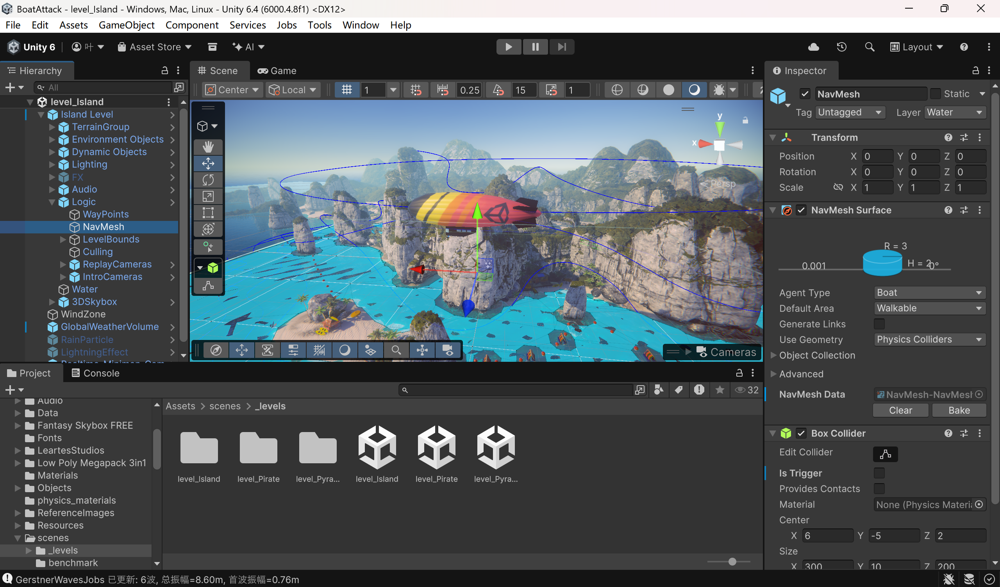

## 5.8
修改了原本的water组件，添加了改变海况的调试，通过改变波浪大小体现不同海况，但当平静海况与恶劣海况之间直接切换时会出现泡沫过密、呈现条状等问题，不够真实。
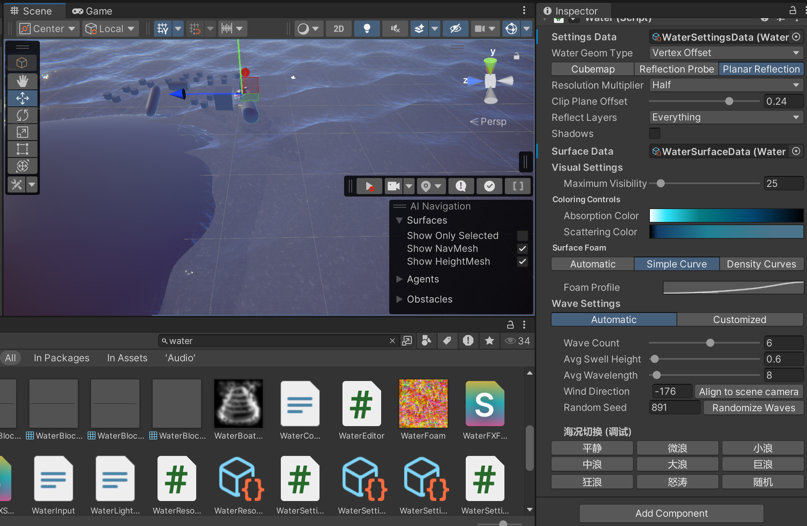

## 4.17
因为全部从零构建所有系统耗时且质量难控，因此决定寻找成熟开源项目为起点，进行针对性的二次开发。

本周针对组员找到的开源项目BoatAttack（<https://github.com/Unity-Technologies/BoatAttack>）进行复现并学习其中的实现方法，计划后续在原项目基础上开发天气和海况系统，丰富游戏玩法。
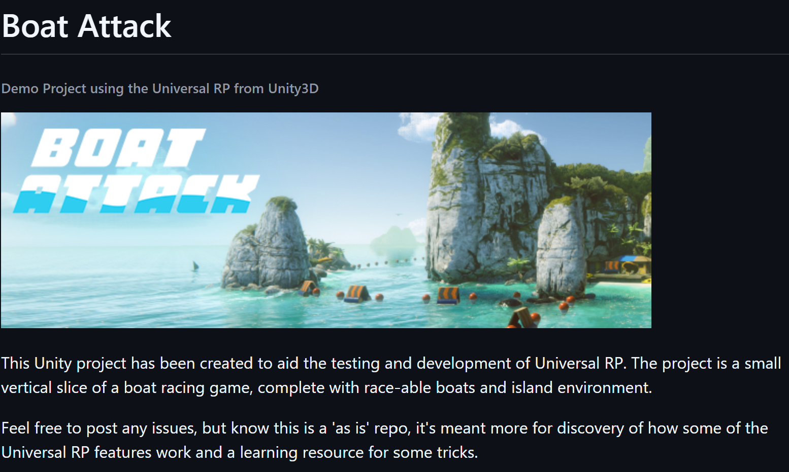
找了两个天气系统插件尝试导入，但出现报错、材质丢失等问题，无法正常运行。

## 4.10
由于小船浮力物理效果不佳，在Github上找到了适配于Unity自带水系统的水面高度查询和浮力脚本（<https://github.com/maximan3000/BuoyancyUnity>），稍作修改后挂载并运行，现在小船浮力物理和海面高度基本匹配。

## 4.3
本周主要研究小船浮力和动力系统，由于有组员做出了可运行的脚本，于是在此基础上把代表小船的立方体替换为小船模型，调整参数使其适配。

## 3.27
本周先了解了HP Water Rendering System for Unity HDRP （基于 Unity HDRP 的HP水体渲染系统），发现开发者只开源了核心源码（<https://github.com/AshenOneArt/HPWater>），缺乏渲染知识与相关经验的情况下难以复现，于是尝试其他方法。
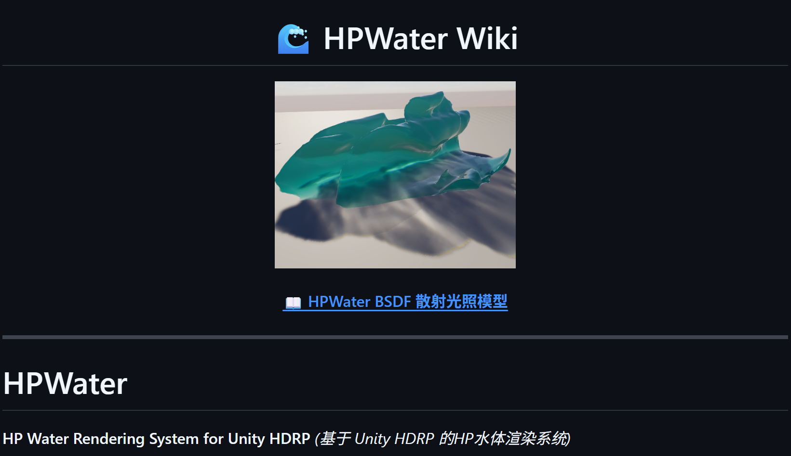
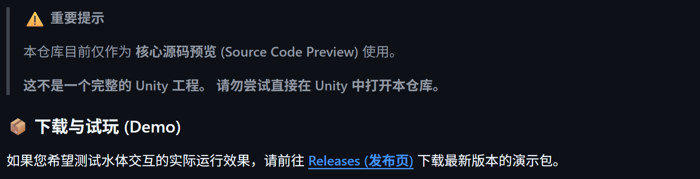
经过搜索发现Unity官方提供了高清渲染管线水系统（HDRP Water System），可以通过此系统在HDRP环境中添加高质量的海洋、河流、水池和湖泊。在Unity 2022 LTS中仅能使用HDRP水系统的部分功能，若要使用完整功能需要至少2023.2或Unity 6，而Unity新版本在中国大陆及港澳地区已不再提供下载或官方支持，Unity中国仅维护Unity 2022 LTS及更早版本，团结引擎‌（基于Unity 2022 LTS）成为国内官方推荐的主力版本，承担后续开发与支持工作，但截至目前也未开发或同步HDRP水系统的更多功能。因此在不考虑安装海外Unity新版本的情况下，使用Unity 2022 LTS或团结引擎中的HDRP水系统仅能完成基本的水体渲染，而更进一步的物理交互需要自己编写脚本实现。
本人使用的编辑器版本是2022.3.62f2c1，通过查阅官方发布的HDRP水系统使用教程在场景中添加了海洋环境，可借助Water Surface组件调整海水颜色、对光线的反应、波浪大小、水流方向与速度等，运行效果良好。
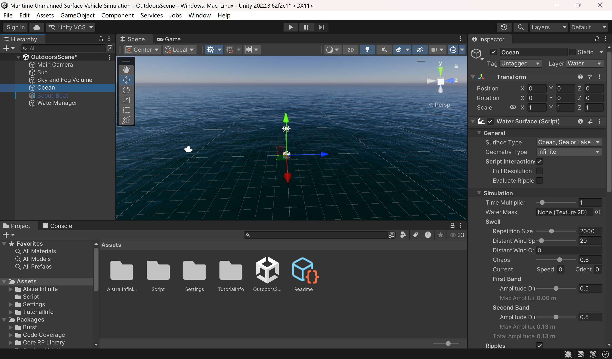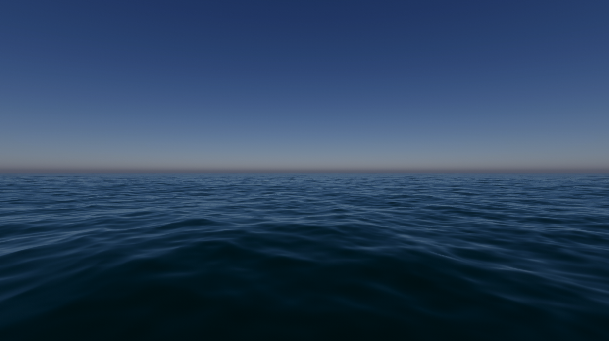
之后本人在Unity官方模型商店中下载了一个小船模型并添加到场景中，为其挂载了Rigidbody和Box Collider组件使其具备物理仿真与碰撞检测基础，并使用AI工具编写脚本尝试实现水面高度查询、小船浮力物理和小船运动控制，但运行效果不佳，小船无法稳定浮于海面。
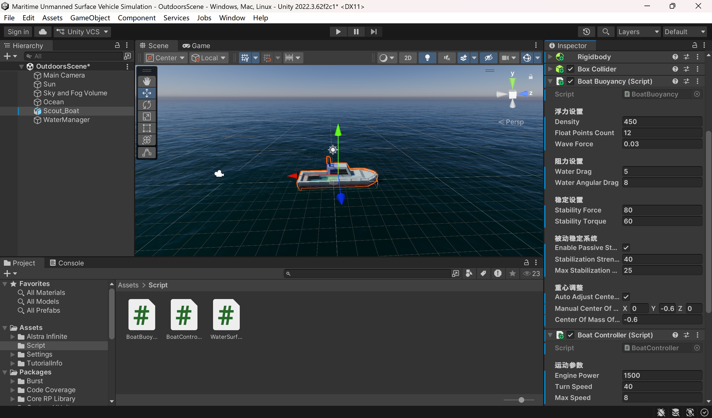
接下来将查询现有的小船浮力与动力相关案例并尝试复现，另外还会在场景中添加更多的岛屿、礁石等模型资产并添加物理碰撞检测，同时还会尝试实现模型的动态生成与清除，呈现出在小船周围一定范围内随机生成障碍物，并在超出范围后清除该模型的效果。