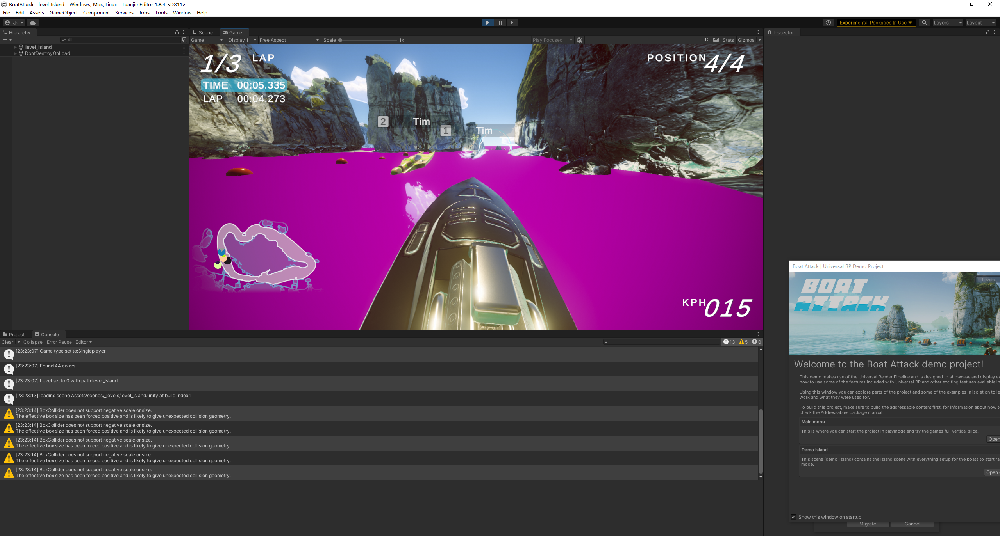
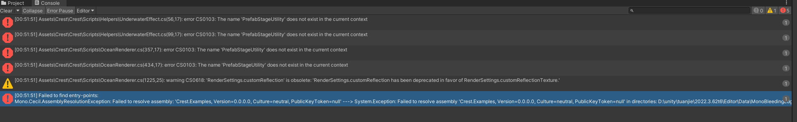
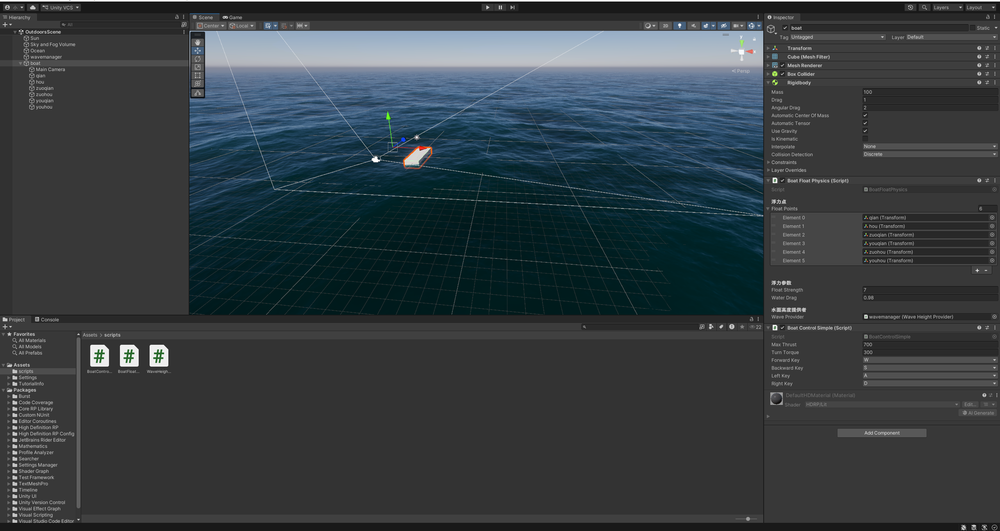
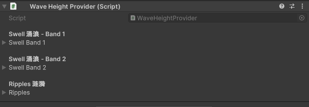
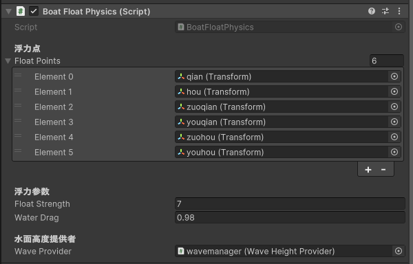
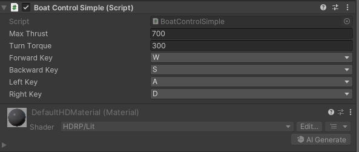
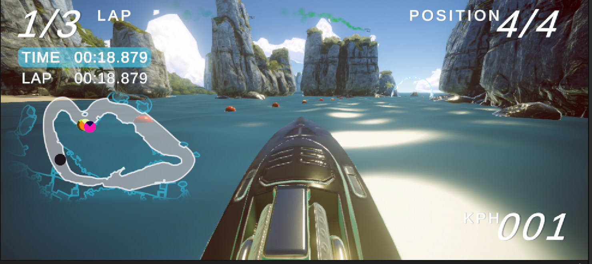

# 4.3
我试着下载boat attack这个项目，在团结引擎上运行，一开始直接下载.zip文件，水的颜色是紫色，并且没有水体的效果，在下载GitLFS后用git bash下载项目也没有效果,可能是团结引擎版本的原因

后来想用crest这个插件来更方便的实现船的浮力的计算，但也有问题

### 简单实现
通过HDRP水系统创建海洋，水面位置设为 Y=0。创建了一个立方体作为船，为船体添加 Rigidbody，设置质量、阻力等参数。在船底创建多个空物体作为浮力点。编写三个脚本：波浪来源、浮力计算与移动控制。在场景中挂载波浪来源，将船体上的浮力脚本和控制脚本配置好，拖入浮力点数组并引用波浪管理器。运行后根据浮沉情况微调浮力强度、推力与阻力。

### WaveHeightProvider
- 通过叠加波，模拟海洋环境
- 
### BoatFloatPhysics
- 遍历浮力点，采样高度并施加浮力
- 
### BoatControlSimple
- 读取 WASD 输入，施加推力与扭矩
- 
# 4.10
借助大模型，boat Attack项目可以在团结引擎上运行了，但是水面效果很差，后续应该使水面效果变好

# 4.24
进一步熟悉了 Boat Attack 项目的整体结构，包括水面系统、船只控制、比赛逻辑、相机和 WayPoints 路线系统。前期考虑过进一步扩展船体与水面的交互，例如让船只尾流更明显地影响水面，或者加入更复杂的 AI 避障和动态赛道事件。
实际查看项目后发现，这些方向需要深入修改水体计算、船只物理或比赛逻辑，容易影响原项目稳定性。因此后续决定优先做新地图和新赛道扩展，在保留原核心系统的基础上，改变场景结构和比赛路线。
# 5.8
主要寻找适合放入 Boat Attack 的免费场景资源。由于 Unity Asset Store 受地区限制，改为从 itch.io 等网站寻找可用资源。尝试后发现，很多资源包偏零散道具，直接用于地图效果不明显，因此后续重点选择占地更大、适合水面环境的场景资源。
同时测试了跨项目导入资源的方法，包括导入 .unitypackage、复制 Demo Scene 中的环境物体，以及使用 Export Package 保留模型、材质和贴图等依赖资源。
# 5.22
完成了新地图的基础搭建。新地图采用多岛布局，将多个岛屿和环境资源重新摆放到水面场景中，形成区别于原地图的空间结构。为了方便管理，新增场景内容统一放在独立父物体下，避免和原项目的 Water、Camera、RaceManager 等核心对象混在一起。
目前地图已经形成基本视觉效果，后续可以围绕多岛区域继续规划赛道路线。
# 6.5
开始基于多岛地图调整赛道。通过查看原项目发现，Boat Attack 的路线主要由 WayPoints 和 Checkpoint 控制，因此本次没有修改船只控制或比赛逻辑，而是通过调整路径点来设计新的闭环赛道。
让赛道围绕多岛区域运行，包括外圈高速段、岛间窄水道、弯道绕行和终点前直线段。调整过程中主要修改 WayPoints 的位置和赛道宽度，避免路线穿过陆地或过于贴近岸边。
