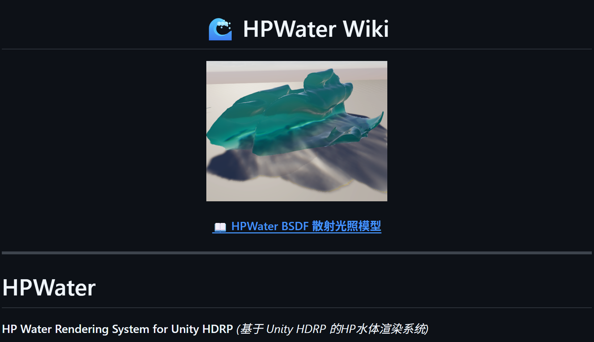
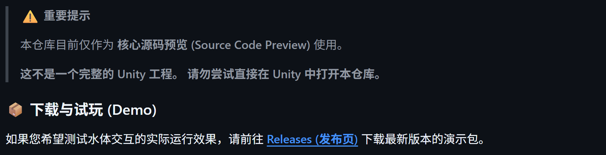
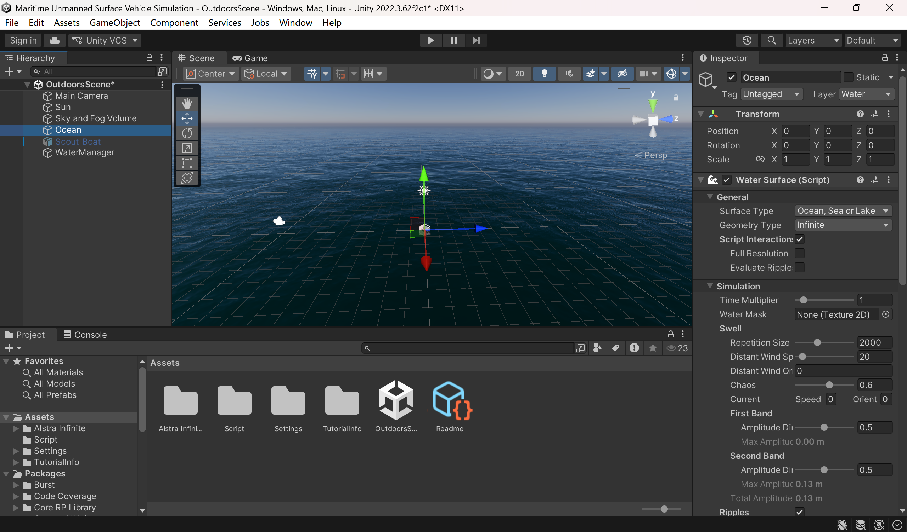
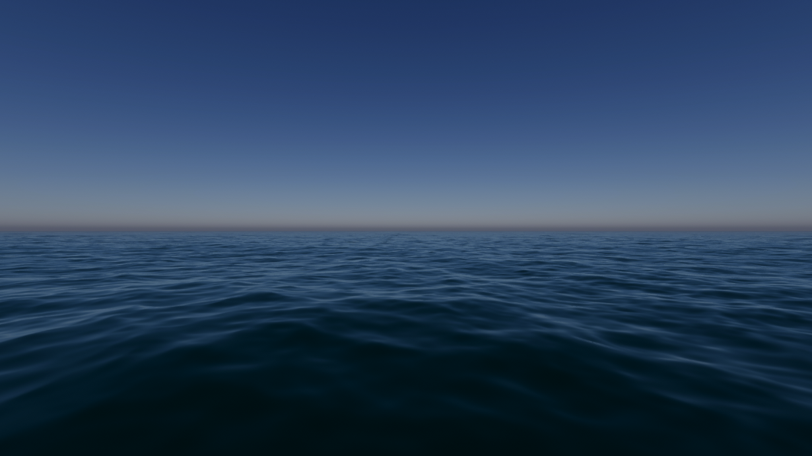
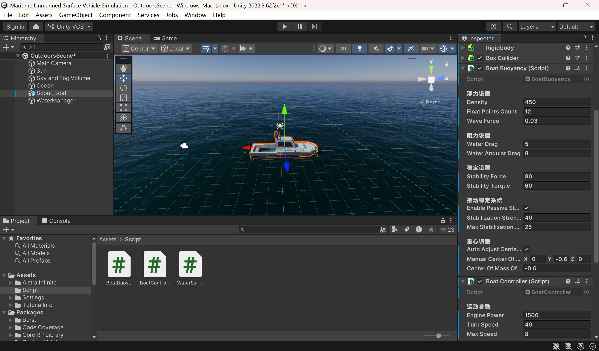

## 3.27
本周先了解了HP Water Rendering System for Unity HDRP （基于 Unity HDRP 的HP水体渲染系统），发现开发者只开源了核心源码（<https://github.com/AshenOneArt/HPWater>），缺乏渲染知识与相关经验的情况下难以复现，于是尝试其他方法。

经过搜索发现Unity官方提供了高清渲染管线水系统（HDRP Water System），可以通过此系统在HDRP环境中添加高质量的海洋、河流、水池和湖泊。在Unity 2022 LTS中仅能使用HDRP水系统的部分功能，若要使用完整功能需要至少2023.2或Unity 6，而Unity新版本在中国大陆及港澳地区已不再提供下载或官方支持，Unity中国仅维护Unity 2022 LTS及更早版本，团结引擎‌（基于Unity 2022 LTS）成为国内官方推荐的主力版本，承担后续开发与支持工作，但截至目前也未开发或同步HDRP水系统的更多功能。因此在不考虑安装海外Unity新版本的情况下，使用Unity 2022 LTS或团结引擎中的HDRP水系统仅能完成基本的水体渲染，而更进一步的物理交互需要自己编写脚本实现。
本人使用的编辑器版本是2022.3.62f2c1，通过查阅官方发布的HDRP水系统使用教程在场景中添加了海洋环境，可借助Water Surface组件调整海水颜色、对光线的反应、波浪大小、水流方向与速度等，运行效果良好。

之后本人在Unity官方模型商店中下载了一个小船模型并添加到场景中，为其挂载了Rigidbody和Box Collider组件使其具备物理仿真与碰撞检测基础，并使用AI工具编写脚本尝试实现水面高度查询、小船浮力物理和小船运动控制，但运行效果不佳，小船无法稳定浮于海面。

接下来将查询现有的小船浮力与动力相关案例并尝试复现，另外还会在场景中添加更多的岛屿、礁石等模型资产并添加物理碰撞检测，同时还会尝试实现模型的动态生成与清除，呈现出在小船周围一定范围内随机生成障碍物，并在超出范围后清除该模型的效果。