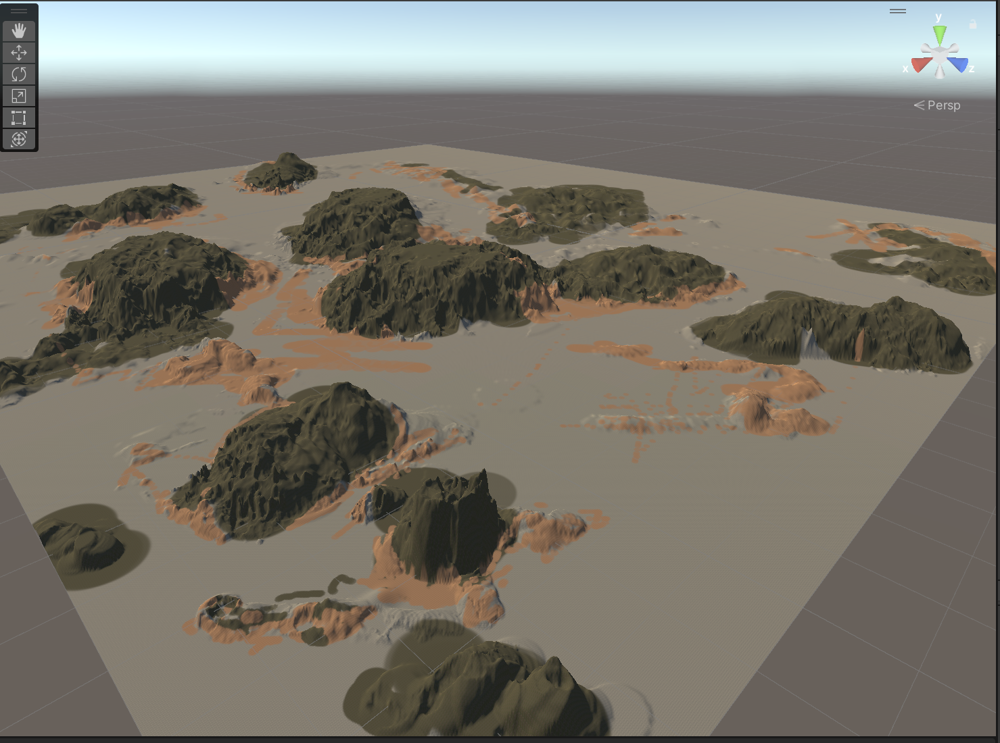
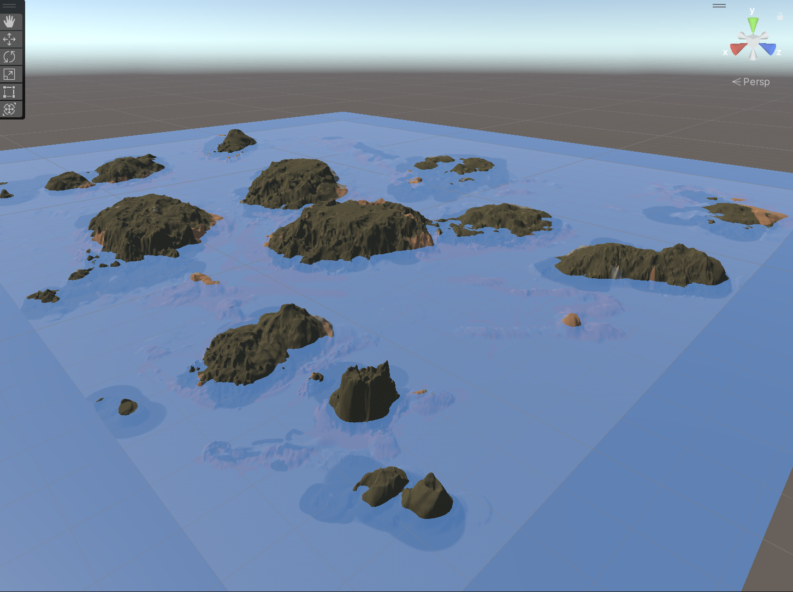

##4月2日
  1.地形构建与多块 Terrain 拼接

使用 Terrain 工具创建并雕刻了主岛屿及周边礁石地形。
通过创建多块 Terrain（Tile）实现了较大范围的水下地形，露出的部分自然形成岛屿与礁石。
解决了 Terrain 笔刷只读、纹理选择等常见新手问题，顺利完成地形雕刻。

  2.地形纹理贴图应用

从 Polyhaven 下载了沙砾（sandy_gravel）、岩石、草地等免费纹理。
正确创建 Terrain Layer 并应用到地形上，使用 Paint Texture 工具完成了沙地、草地、岩石等不同区域的纹理刷涂，岛屿初步具备了视觉层次。

  3.水面系统搭建

创建了 Plane 作为水面，并根据多块 Terrain 的坐标范围（约 -1000 到 1500）调整了 Scale（300×300）与 Position，使其完全覆盖所有地形。
创建了半透明蓝色材质（Rendering Mode 设为 Transparent），水面在 Scene 视图中显示正常。
调整了 Main Camera 位置与角度，使 Game 视图能够更好地观察岛屿与水面关系（目前 Game 视图水面显示问题已定位为相机视角问题）。

  遇到的问题与解决：
Terrain 笔刷无反应 → 排查了选中对象、工具栏图标、Scene 视图焦点、刷子只读等问题，逐一解决。
纹理素材缺失 → 使用 Polyhaven 免费资源替代 Asset Store，成功导入 diff 颜色贴图并创建 Terrain Layer。
水面在 Game 视图不可见 → 确认 Scene 视图水面存在，判断为相机位置过高或视角问题，已给出调整方案。
  下一步计划：
优化相机位置，确保 Game 视图能清晰看到水面与岛屿效果。
添加树木植被（Paint Trees），进一步丰富岛屿细节。
继续调研小船浮力与动力系统相关案例，尝试实现稳定浮力效果。
与组员确认 Unity 版本、渲染管线及项目合并方式，为后续整合做准备。

##3月26日
  1.熟悉unity-hub
  2.尝试复现GitHub上的HPWater