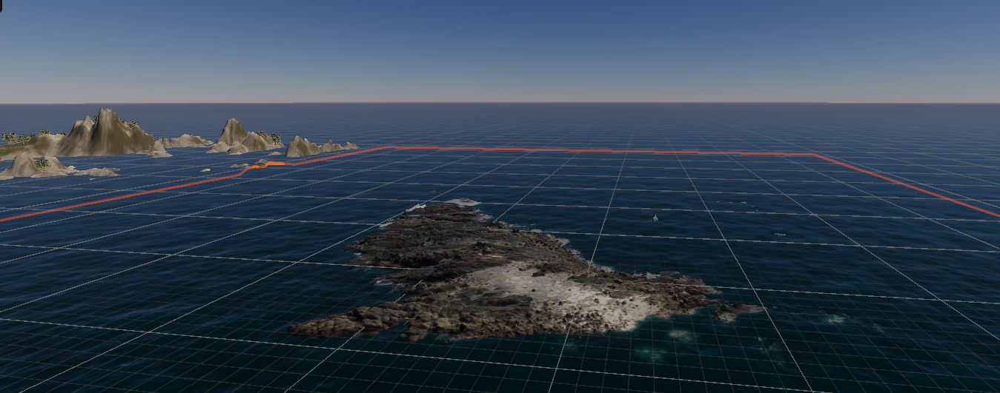
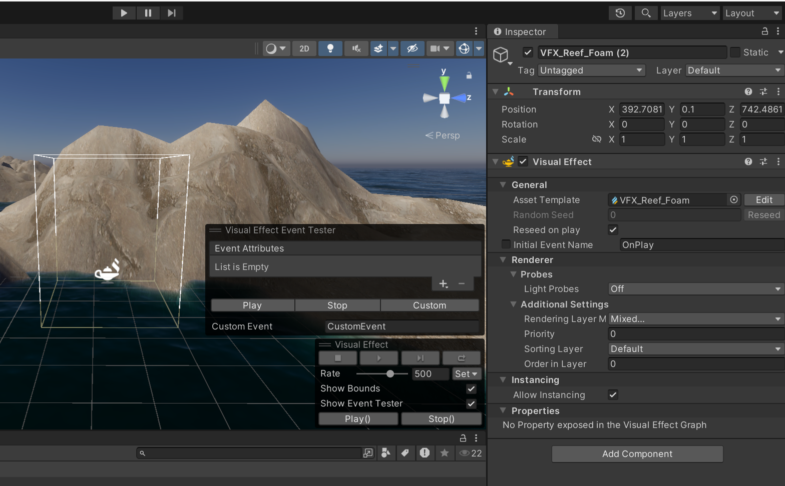
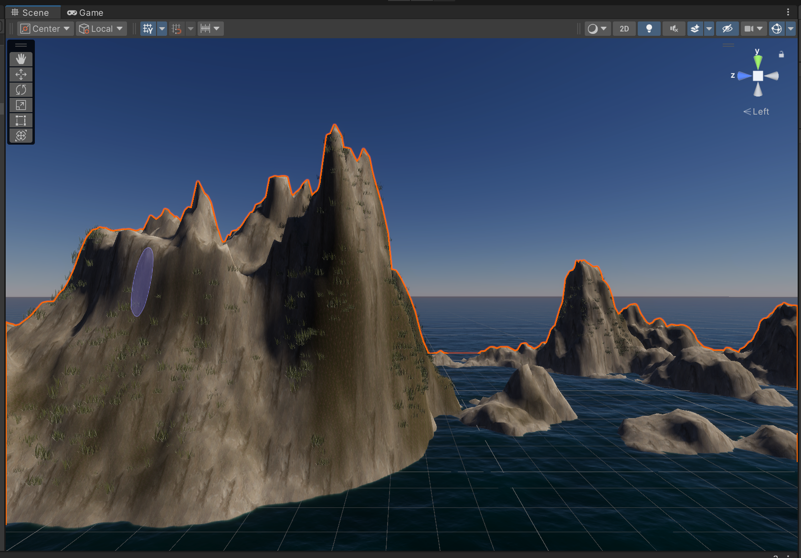
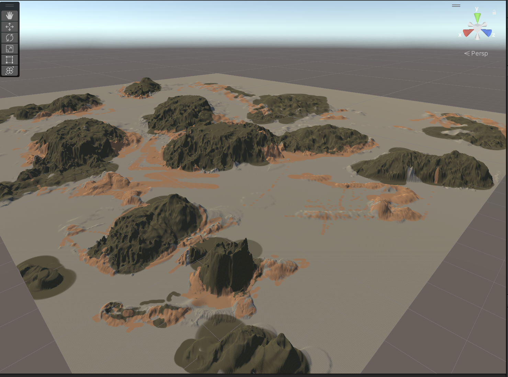
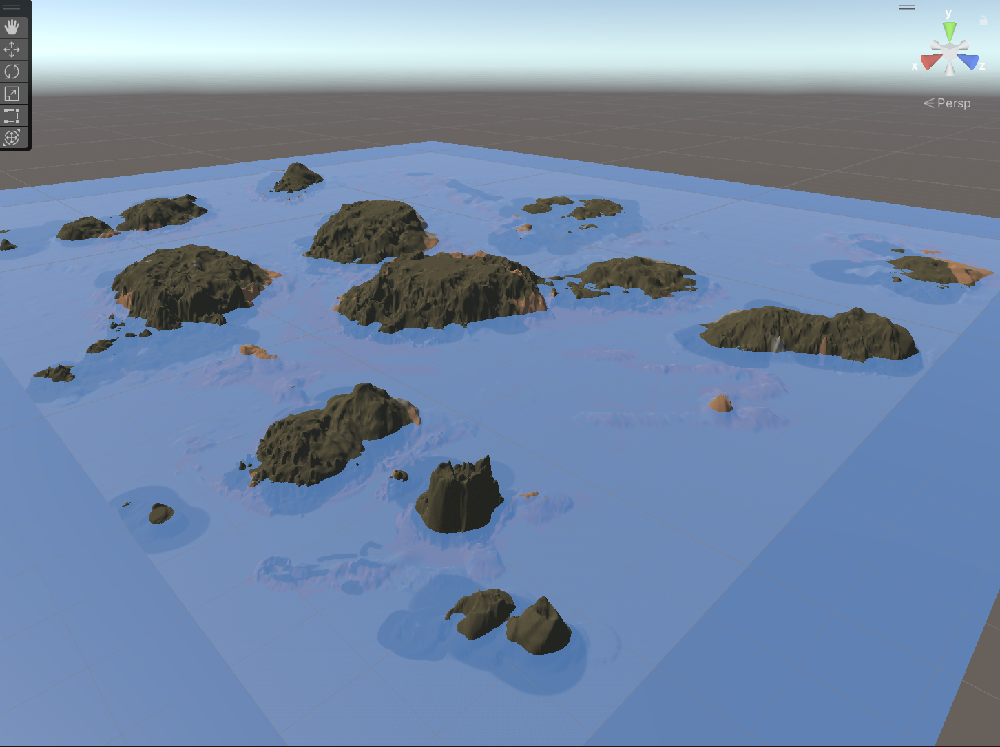

##  5月19日
由于上次的项目完全无法打开，于是重新选择了编辑器，并重新开始搭建天气系统。
本次开发在 BoatAttack 项目基础上完成了天气视觉系统的完整实现，涵盖脚本开发、粒子效果配置、音效集成及场景适配。
1. 天气系统核心开发
WeatherManager 脚本开发：在 Assets/WeatherSystem/ 下创建 WeatherManager.cs，实现五种天气状态（晴天、阴天、雨天、雾天、雷雨）的统一管理。通过 Random.InitState 结合系统时间戳实现每次进入场景的随机天气，通过 URP Volume Profile 中的 ColorAdjustments 与 WhiteBalance 控制画面曝光、色调与冷暖变化。
粒子雨效果：创建 RainParticle 粒子系统，使用 Stretched Billboard 模式模拟雨丝拉伸效果，将 Simulation Space 设为 World 确保全局可见，并通过 Update 协程实现粒子跟随主摄像机移动，解决了固定位置导致雨效不可见的问题。
闪电系统：创建 LightningEffect 脚本，基于 Directional Light 实现随机闪电效果，协程控制闪烁频率（间隔3~8秒随机），模拟双闪效果增强真实感，仅在雷雨天气下激活。
雾天效果
雨天效果

https://github.com/user-attachments/assets/ccc7e6b7-7627-46a3-b83b-a52a93ee964e

阴天效果
雷雨天效果

https://github.com/user-attachments/assets/295eadb5-6bec-44aa-b7c6-be3116bde014

3. 音效集成
为雨天与雷雨天气分别配置音效，rain_only.wav 用于普通雨天循环播放，thunder_rain.wav 用于雷雨天气。针对雷声音频存在前置静音段的问题，通过设置 audioSource.time = 4f 从指定时间点开始播放，实现闪电与雷声的时序分离，符合现实中光速快于声速的自然规律。
4. 多场景适配
将天气系统相关对象（GlobalWeatherVolume、RainParticle、LightningEffect）制作为 Prefab，复用部署至 level_island 场景，完成了从主菜单进入比赛后天气系统的正常运行。
5. 待解决问题

从 main_menu 跳转 level_island 时天气随机性偶发异常，场景切换初始化时序需进一步调试
雷雨天气音效与闪电视觉效果的同步精度有待优化

5月7日 项目依赖问题排查与修复记录
本次开发过程中遭遇了一系列由依赖包引发的连锁问题，记录排查过程供后续参考。
1. gameplay-ingredients 包无法下载
项目原依赖 net.peeweek.gameplay-ingredients 通过 GitHub git 链接安装，因网络限制连接超时，导致项目启动时弹出 Package Manager Error。先后尝试了 ghproxy.com、mirror.ghproxy.com 等镜像地址，均因域名解析失败而无效。最终尝试将包源码手动下载放入 Packages 目录，但因下载的是 master 分支而非项目所需的 2019.3.0 版本，引发了 NaughtyAttributes 等二级依赖缺失，导致 400+ 编译错误。
2. AppSettings.cs 编译失败
由于 gameplay-ingredients 包缺失，AppSettings.cs 中对 GameplayIngredients 命名空间、Manager 基类、ManagerDefaultPrefab Attribute 的引用全部报错，导致项目无法编译进入 Play 模式。通过修改 AppSettings.cs，移除相关 using 和 Attribute，将类继承从 Manager 改为 MonoBehaviour，解决了编译错误。
3. Library 缓存损坏
多次修改 manifest.json 与强制重导入操作导致 Unity 资源数据库损坏，场景中出现大面积粉红色材质（天空盒、山体地形）。通过关闭 Unity 后删除 Library 文件夹，重新打开项目强制重建缓存，并重新执行 Addressables Build，场景一直未恢复正常。
4. 游戏流程卡住
修复编译错误后发现 Play 模式下游戏会卡在加载帧无法进入赛艇界面。排查发现原因是 gameplay-ingredients 的 Manager 系统负责自动创建 AppManager 对象并初始化游戏流程，包缺失后该流程中断。通过 git 恢复原始的 AppSettings.cs 与 manifest.json，并重建 Library，但始终无法解决。
总结：最后项目已经完全无法打开，会有闪退问题。

## 4月30日 天气系统开发
继成功复刻项目后，本次工作重点转向天气视觉系统的开发，为赛艇场景添加动态天气效果。
1. WeatherManager 核心脚本
天气状态管理： 在 Assets/Scripts/Environment/ 下创建 WeatherManager.cs，实现了五种天气状态的统一管理：晴天、阴天、雨天、暴风雨、大雾。每种天气均配有独立的光照强度、雾效密度、环境光颜色等参数，可在 Inspector 中直接调节。
平滑过渡系统： 基于 SmoothStep 插值协程实现天气之间的平滑切换，默认过渡时长 3 秒，光照、雾色、环境光全程插值过渡，避免天气突变的割裂感。
2. 粒子雨效果
创建 RainParticles 与 HeavyRainParticles 两套粒子系统，分别对应普通降雨与暴风雨场景。使用 Stretched Billboard 渲染模式模拟雨丝拉伸效果，发射速率由 WeatherManager 在运行时动态控制，普通雨 300粒/秒，暴风雨 800粒/秒。
3. 闪电系统
基于 Point Light 实现随机闪电效果，通过协程控制闪烁节奏（间隔 3~8 秒随机触发），模拟双闪效果增强真实感，仅在 Stormy 天气状态下激活。
4. 场景集成
在 demo_island 场景中创建 WeatherSystem 空对象，挂载 WeatherManager 脚本，关联场景中的 Directional Light、RainParticles、HeavyRainParticles、LightningLight，实现了运行时在 Inspector 中切换天气类型的功能。

##4月9日 仿真环境进阶与礁石细节开发记录

继上次地形基础搭建完成后，本次工作重点转向了自定义模型融合、物理材质解绑以及海浪环境特效（VFX）的开发。

  1. 外部模型集成与材质解绑 (核心技术突破)
OBJ模型导入与纹理重构： 针对导入的 Reef（礁石）模型材质被“锁死”（只读状态）的问题，通过创建独立的 HDRP/Lit 材质球并手动映射纹理贴图，成功实现了外部模型与场景视觉风格的统一。

UV与平铺（Tiling）优化： 针对大型礁石模型，通过精确调整材质球的 Tiling 比例，解决了纹理拉伸问题，使礁石的岩石纹理颗粒度与原生 Terrain 地形保持一致。

  2. 海浪动力学视觉开发 (VFX Graph 应用)
礁石浪花特效实现： 利用 Visual Effect Graph 开发了专用的 VFX_Reef_Foam 系统。通过 Turbulence（湍流） 节点模拟了真实水沫的随机晃动感，并利用 Size over Life 曲线实现了浪花飞溅扩散的动态效果。

HDRP 高动态渲染调优： 针对海面高亮反射导致的视觉淹没问题，通过调整粒子的 HDR Intensity（曝光强度）和 Alpha 渐变，确保浪花在不同光照角度下均清晰可见。

高度对齐与坐标修正： 精确校准了 VFX 发射器与 Water Surface 的 Y 轴相对位置。但实际效果好像并不理想，场景显示不出浪花效果。

  3. 无人艇（USV）系统集成与物理调试
  动力参数优化： 对开发的 Boat Control Simple 脚本进行了实测，针对当前场景比例调整了 Max Thrust（推力）与 Turn Torque（转向转矩），改善了无人艇的操作手感。

  4. 协同开发与版本健康管理
  Git 资产同步： 完成了新增 .vfx 资产、.mat 材质球及高清贴图的 Git LFS 追踪提交。

  Overrides 预制体管理： 规范化了 Scout_Boat 预制体的参数覆盖操作（Apply All），确保了场景参数修改能有效同步至全队共享的 Prefab 资产。

##4月4日
 由于上传文件过程中文件缺失，因此再次搭建了地形
 
 
  1.项目基础环境与协同开发配置：

   针对项目多人协作需求，完成了 .gitignore 文件的优化，确保了 Logs/ 等临时文件被有效隔离，避免了无效文件上传导致的版本冲突。
   

   成功配置 Git LFS (Large File Storage)：通过命令行初始化并追踪了 .asset 和 .unity 等关键地形与场景文件。此举彻底解决了 GitHub 100MB 大文件上传限制，为后续团队多人实时协作及大场景同步铺平了道路。

   海岛地形开发 (核心进度)：

   完成了海岛地形的基础塑造，并通过 Terrain Data 文件的重命名与管理，规范了地形资源的存储路径，建立了良好的资源追溯机制。

   实现了地形纹理的层级管理：完成了“山色/石头”底层的铺设与“草色”的涂抹，并通过调整纹理 Tiling 参数优化了视觉表现。

   添加了草地模型细节（Detail Mesh），通过对 Detail Density 和笔刷强度的精细调整，成功实现了海岛自然植被的覆盖，并完成了大小与密度的参数化设定。

  2.版本控制与防灾备份：

   完成了项目初次提交（Initial Commit），目前项目环境已成功接入 Git LFS，实现了高效且安全的增量同步。

  当前进度状态：
   地形环境： 已完成起伏、贴图及植被种草，地形数据已稳定进入版本控制链路。

  代码仓库： 仓库配置健康，LFS 指针文件已生效，已避开所有上传风险，后续开发可保持“小步快跑”的同步节奏。

  
##4月2日
  1.地形构建与多块 Terrain 拼接

使用 Terrain 工具创建并雕刻了主岛屿及周边礁石地形。
通过创建多块 Terrain（Tile）实现了较大范围的水下地形，露出的部分自然形成岛屿与礁石。
解决了 Terrain 笔刷只读、纹理选择等常见新手问题，顺利完成地形雕刻。

  2.地形纹理贴图应用

从 Polyhaven 下载了沙砾（sandy_gravel）、岩石、草地等免费纹理。
正确创建 Terrain Layer 并应用到地形上，使用 Paint Texture 工具完成了沙地、草地、岩石等不同区域的纹理刷涂，岛屿初步具备了视觉层次。

  3.水面系统搭建

创建了 Plane 作为水面，并根据多块 Terrain 的坐标范围（约 -1000 到 1500）调整了 Scale（300×300）与 Position，使其完全覆盖所有地形。
创建了半透明蓝色材质（Rendering Mode 设为 Transparent），水面在 Scene 视图中显示正常。
调整了 Main Camera 位置与角度，使 Game 视图能够更好地观察岛屿与水面关系（目前 Game 视图水面显示问题已定位为相机视角问题）。

  遇到的问题与解决：
Terrain 笔刷无反应 → 排查了选中对象、工具栏图标、Scene 视图焦点、刷子只读等问题，逐一解决。
纹理素材缺失 → 使用 Polyhaven 免费资源替代 Asset Store，成功导入 diff 颜色贴图并创建 Terrain Layer。
水面在 Game 视图不可见 → 确认 Scene 视图水面存在，判断为相机位置过高或视角问题，已给出调整方案。
  下一步计划：
优化相机位置，确保 Game 视图能清晰看到水面与岛屿效果。
添加树木植被（Paint Trees），进一步丰富岛屿细节。
继续调研小船浮力与动力系统相关案例，尝试实现稳定浮力效果。
与组员确认 Unity 版本、渲染管线及项目合并方式，为后续整合做准备。

##3月26日
  1.熟悉unity-hub
  2.尝试复现GitHub上的HPWater
