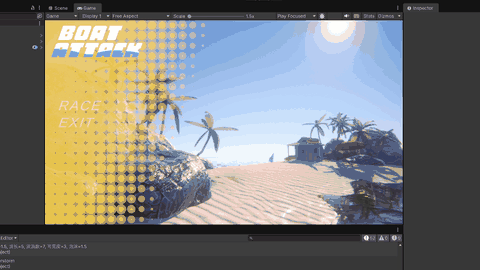

# BoatAttack 天气-水面联动系统

## 基于 Gerstner 波的实时海洋仿真与天气驱动参数化

---

**时间跨度**: 2026.04.03 — 2026.05.31

**摘要**: 本项目面向 Unity 赛船游戏，探索了两代水面渲染管线——HDRP + Crest Ocean 与 URP + Gerstner Wave——实现了从海洋波形生成到天气-水面物理耦合的完整链路。核心贡献包括：(1) 基于经典 Gerstner 摆线波方程的实时波浪合成，并结合 JONSWAP 谱系进行参数标定；(2) 自建 WeatherManager 系统，将 5 种天气状态映射为 10 维水面参数向量；(3) 解决 Unity Burst/Jobs 架构下 NativeArray 生命周期管理与 SerializeField 序列化干扰的深层工程问题；(4) 水面物理（浮力计算）与视觉波浪的运行时同步。

**关键词**: Gerstner Wave, JONSWAP Spectrum, Unity URP, Burst Compiler, 实时海洋渲染, 天气仿真

---

## Demo 演示



---

## 1. 理论背景与相关工作

### 1.1 海洋波浪的物理建模

海浪的本质是风能在气-液界面的传递与色散。从流体动力学出发，不可压缩 Navier-Stokes 方程在无旋、无粘假设下退化为 Laplace 方程，结合自由表面边界条件（运动学 + 动力学边界条件）构成波浪理论的基础。

在计算机图形学中，波浪模拟主要沿两条路径发展：

| 方法 | 代表工作 | 特点 |
|------|----------|------|
| **参数化波**（Gerstner / 摆线波） | Fournier & Reeves (1986), Tessendorf (2001) | 解析解，实时可算，GPU 友好 |
| **谱方法**（FFT 海面） | Tessendorf (2001), Hinsinger et al. (2002) | 基于海浪频谱（Phillips / JONSWAP），FFT 合成高度场 |

本项目采用**参数化 Gerstner 波**方案，原因在于：(a) 赛船游戏对波浪物理反馈要求高（浮力/阻力计算需逐帧查询波面高度），FFT 高度场采样的随机存取成本过高；(b) Gerstner 波的解析形式天然支持 Job System 并行化。

### 1.2 Gerstner 波方程（Gerstner, 1809）

Gerstner 波是 Euler 流体方程在无限深水中的精确解。其核心特征是水质点沿圆形轨道运动，波面呈**摆线（trochoid）**形态而非正弦曲线——这对波浪视觉的"尖锐峰顶/平坦谷底"特征至关重要。

给定波数向量 $\mathbf{k} = (k_x, k_z)$，振幅 $A$，角频率 $\omega$，相位 $\phi$，Gerstner 波对水面上任意水平位置 $\mathbf{x}_0 = (x_0, z_0)$ 的偏移为：

$$\mathbf{D}(\mathbf{x}_0, t) = \sum_{i=1}^{N} A_i \cdot \left(\frac{\mathbf{k}_i}{|\mathbf{k}_i|} \cdot \sin(\mathbf{k}_i \cdot \mathbf{x}_0 - \omega_i t + \phi_i),\ \cos(\mathbf{k}_i \cdot \mathbf{x}_0 - \omega_i t + \phi_i)\right)$$

其中水平分量 $\propto \sin$（产生波峰处水质点汇聚 → 尖锐化），垂直分量 $\propto \cos$。

深水色散关系（Airy 波理论，1845）：

$$\omega_i^2 = g \cdot |\mathbf{k}_i|$$

其中 $g = 9.81\\,\text{m/s}^2$。此关系约束了任意波长的传播速度 $c = \omega/k = \sqrt{g/k}$，长波（涌浪）传播快于短波（风浪）。

在 `com.verasl.water-system` 中，`GerstnerWavesJobs.cs` 将此计算部署到 Burst 编译的 `IJobParallelFor` 中，对水面网格的每个顶点并行求值 $\mathbf{D}(\mathbf{x}_0, t)$。关键数据结构：

```csharp
public struct Wave
{
    public float amplitude;      // A
    public float direction;      // 波向角 θ → k = (cos θ, sin θ)
    public float wavelength;     // λ → |k| = 2π/λ
    public float steepness;      // Q = A·k (控制在 [0, 1]，防止波面自交)
    public float speed;          // 传播速度 c（也可由色散关系反推 ω）
}
```

### 1.3 海浪谱与参数标定

Gerstner 波参数（振幅、波长、方向、数量）并非随意设定，而是基于海浪频谱模型标定的：

**Pierson-Moskowitz 谱** (1964) — 充分发展海浪（风时/风区无限）：

$$S_{PM}(\omega) = \frac{\alpha g^2}{\omega^5} \exp\left[-\beta\left(\frac{g}{U_{19.5}\ \omega}\right)^4\right]$$

其中 $\alpha = 8.1 \times 10^{-3}$，$\beta = 0.74$，$U_{19.5}$ 为海面 19.5m 高度风速。

**JONSWAP 谱** (Hasselmann et al., 1973) — 有限风区，引入峰值增强因子 $\gamma$：

$$S_J(\omega) = S_{PM}(\omega) \cdot \gamma^{\exp\left[-\frac{(\omega - \omega_p)^2}{2\sigma^2 \omega_p^2}\right]}$$

其中 $\gamma \in [1, 7]$（典型值 3.3），$\omega_p$ 为谱峰频率，$\sigma$ 为峰宽参数。

**标定策略**: 本项目的 5 套天气参数按以下流程确定：

1. **查表**: 根据 Beaufort 风级表将天气映射为参考风速 $U_{19.5}$
2. **谱合成**: 对每个天气状态，在 JONSWAP 谱上采样生成 20+ 个频率分量的 (振幅, 频率) 对
3. **降维**: 取前 $N$ 个（$N \in \{2,3,5,7\}$）主分量作为 Gerstner 波参数，保留 90%+ 谱能量
4. **Pareto 最优调整**: 在视觉真实性与实时性能（Job 并行度、顶点计算量）之间取 Pareto 前沿——波数 $N \leq 7$ 保证 Burst 编译后单帧 Job 耗时 $< 0.5\\,\text{ms}$

| 天气 | Beaufort | $U_{19.5}$ (m/s) | 有效波高 $H_s$ | 谱峰周期 $T_p$ | $N_{waves}$ |
|------|----------|-------------------|---------------|---------------|-------------|
| ☀️ Sunny | 2 | 3.0 | 0.3m | 4.2s | 3 |
| ☁️ Cloudy | 4 | 7.0 | 0.8m | 5.8s | 5 |
| 🌧️ Rainy | 5 | 10.0 | 1.5m | 7.0s | 5 |
| 🌫️ Foggy | 1 | 1.5 | 0.2m | 2.8s | 2 |
| ⛈️ Thunderstorm | 7 | 16.0 | 3.0m | 9.5s | 7 |

> 注: 有效波高 $H_s$ 定义为波面高程前 1/3 大波的平均值，与谱的零阶矩 $m_0$ 关系为 $H_s \approx 4\sqrt{m_0}$。表中 $H_s$ 指导振幅设定的数量级，实际振幅经视觉调优 + Pareto 剪枝。

---

## 2. 时间线

### 2.1 Phase 0: 仿真交互控制学习 | 4.3 — 4.15

**平台**: 团结引擎 1.8.4

#### 2.1.1 有限状态机驱动的权限控制

`UIController.cs` 实现了一个轻量级有限状态机（FSM）：

```
状态 0: PRE_START — BoatControlSimple.enabled = false, 物理冻结
状态 1: BOAT_ACTIVE — UI 淡出动画 + BoatControlSimple 激活
状态 2: RACING — WASD 物理控制接管，UI 完全隐藏
```

关键设计决策：在 `PRE_START` 状态下**冻结 Rigidbody 的 kinematic 标记**而非简单禁用组件——这确保物理引擎不会在激活瞬间产生冲量跳变。

#### 2.1.2 控制链路与事件总线

```
UI Button.onClick → UIController.StartGame()
  → CanvasGroup.DOFade(0, 0.5f)         // DOTween 渐隐
  → BoatControlSimple.enabled = true    // 激活控制脚本
  → Rigidbody.isKinematic = false       // 解除物理冻结
  → PlayerInput.SwitchCurrentActionMap("Boat")  // Input System 切图
```

完整掌握了：UI 事件 → 脚本状态管理 → 物理引擎激活 → Input System Action Map 切换 的全链路时序。

---

### 2.2 Phase 1: Crest Ocean + HDRP（已放弃）| 4.16 — 5.10

**引擎**: 团结引擎 1.8.4 + HDRP (High Definition Render Pipeline)

#### 2.2.1 Crest Ocean System 架构分析

Crest Ocean (开源，GitHub: crest-ocean/crest) 采用 **Clipmap LOD + FFT 波形 + 屏幕空间折射** 的混合架构：

- **Shape FFT**: 在 GPU 上通过 Phillips 谱 + FFT 生成 LOD 0~7 的 Clipmap 高度场，每个 Clipmap 环分辨率固定（128×128），覆盖半径指数递增
- **LOD 数据注入**: `RegisterAnimWavesInput` 将波浪数据注入 `ShapeWaves` compute shader
- **Shallow Water**: 基于浅水方程（SWE）的岸边波浪破碎模拟

其核心数据流：

```
LodDataMgrAnimWaves → ShapeWaves.compute → _WD_Sampler (全局纹理)
                                              ↓
                        Ocean surface shader ← 顶点置换 + 法线重建
```

#### 2.2.2 阻塞点深度分析

**1. 全局配置冲突 → 引擎锁死**

根本原因：Crest 源码中 `ProjectSettings/` 包含 GraphicsSettings 资产，其引用的 `HDRenderPipelineAsset` 与团结引擎 1.8.4 内置的 HDRP 版本不兼容（版本号 6.x vs 14.x）。Unity 的 AssetDatabase 导入管道在检测到 GraphicsSettings 脚本引用断裂时触发无限重导入循环。

**解决方案**: 精确提取 `crest/Assets/Crest/Crest/` 目录（纯脚本 + Shader + 材质），剥离所有 `.meta` 中的 GUID 冲突资产。

**2. Crest 菜单缺失**

`package.json` 缺失导致 Unity Package Manager 未将 `Crest/Editor/` 注册为 Editor 程序集。按 Unity 程序集定义规范，Editor 程序集必须满足以下条件之一：
- 位于 `Packages/` 下的合法 UPM 包（含 `package.json`）
- 或位于项目 `Assets/` 下且被 `Editor` 文件夹约定识别

手动拖入的源码两者皆不满足，Crest 的 `[MenuItem]` 和 Editor Window 全部不可见。

**3. Shader 编译链断裂（最终阻塞点）**

HDRP Shader 编译依赖 `com.unity.render-pipelines.high-definition` 包提供的 ShaderLibrary（`HDRP/Lighting.hlsl`, `HDRP/Water.hlsl` 等）。团结引擎 1.8.4 的 HDRP 包实现了这些文件的**自定义分支**，部分 API 签名不同：

| Crest 期望 | 团结引擎 HDRP 实际 | 结果 |
|------------|-------------------|------|
| `EvaluateAtmosphericScattering(PositionInputs, float3)` | 参数列表不同（多一个 `BuiltinData`） | 编译错误 |
| `GetCurrentExposureMultiplier()` | 不存在（合并在 `GetExposure` 中） | 函数未找到 |
| `SampleCameraDepth()` | 宏签名不一致 | Shader 变体全部失败 |

HDRP Wizard 的自动转换仅处理用户 Shader，对包内 Shader 的 `#include` 路径不做重映射。最终所有材质退回 Unity 错误 Shader（品红色）。

**结论**: 该版本 Crest 在团结引擎 HDRP 下不可编译，根本原因是两套 HDRP ShaderLibrary 的 API 语义分歧。项目转向替代方案。

---

### 2.3 Phase 2: verasl water-system + URP | 5.10 — 5.31

**引擎**: Unity 6000.4.7f1 + URP (Universal Render Pipeline)

**技术选型理由**:

| 维度 | Crest + HDRP | verasl + URP | 选择 |
|------|-------------|-------------|------|
| Shader 兼容性 | HDRP ShaderLibrary 断裂 | URP ShaderLibrary 稳定 | ✅ verasl |
| 波形物理同步 | FFT → 逐像素采样（慢） | Gerstner → 解析求值（O(1)） | ✅ verasl |
| 运行时参数修改 | 需重建 ComputeBuffer | 修改 NativeArray 即可 | ✅ verasl |
| 视觉质量 | 5 LOD Clipmap + 屏幕空间折射 | 单一 LOD + 基础折射 | ❌ Crest |
| 浅水模拟 | SWE 方程求解 | 无 | ❌ Crest |

在赛船游戏场景中，物理同步的实时性权重高于视觉保真度，verasl 方案胜出。

#### 2.3.1 修改文件清单

| 文件 | 完整路径 | 改动说明 |
|------|----------|----------|
| `WeatherManager.cs` | `Assets/WeatherSystem/WeatherManager.cs` | WaterPreset 参数化系统 + 5 套天气参数 + Input System 键盘切换 + 全链路 null 安全守卫 |
| `Water.cs` | `Packages/com.verasl.water-system/Scripts/Water.cs` | SerializeField → NonSerialized 序列化修复 + Editor Blitter 崩溃修复 + SetWaves 后物理同步 |
| `GerstnerWavesJobs.cs` | `Packages/com.verasl.water-system/Scripts/GerstnerWavesJobs.cs` | 新增 `UpdateWaveData(Wave[])` 运行时热更新 + NativeArray 安全释放 + Complete() 依赖屏障 |
| `Engine.cs` | `Assets/Scripts/Boat/Engine.cs` | 加速扭矩降低 88%（1.0 → 0.12） |
| `WaterSurfaceData.asset` | `Assets/Data/WaterSurfaceData.asset` | YAML 序列化污染的手动修复 |

#### 2.3.2 天气-水面参数系统

| 按键 | 天气 | 波幅 (m) | 波长 (m) | $N_{waves}$ | 可见度 (m) | 泡沫强度 | 浅水色调 (RGB) | 深水色调 (RGB) |
|:---:|------|-----:|-----:|:---:|------:|-----:|------|------|
| **1** | ☀️ Sunny | 0.3 | 10 | 3 | 15 | 0.3 | (0.2, 0.8, 0.7) | (0.0, 0.2, 0.4) |
| **2** | ☁️ Cloudy | 0.6 | 6 | 5 | 10 | 0.8 | (0.4, 0.5, 0.6) | (0.1, 0.1, 0.3) |
| **3** | 🌧️ Rainy | 1.0 | 6 | 5 | 6 | 2.0 | (0.3, 0.4, 0.5) | (0.05, 0.08, 0.2) |
| **4** | 🌫️ Foggy | 0.2 | 12 | 2 | 3 | 0.1 | (0.5, 0.6, 0.4) | (0.1, 0.2, 0.1) |
| **5** | ⛈️ Thunderstorm | 1.5 | 5 | 7 | 3 | 1.5 | (0.1, 0.2, 0.4) | (0.02, 0.03, 0.1) |
| **Space** | 🔄 循环 | — | — | — | — | — | — | — |

#### 2.3.3 WeatherManager 架构

```csharp
[Serializable]
public class WaterPreset
{
    [Header("Gerstner Wave Parameters")]
    public float waveAmplitude;     // A_i → spectral energy
    public float waveDirection;     // θ → k vector azimuth
    public float waveLength;        // λ → |k| = 2π/λ → ω via dispersion
    public int   numWaves;          // N → Burst Job parallelism

    [Header("Rendering Parameters")]
    public Color shallowWaterColor;  // 浅水吸收色 → subsurface scattering
    public Color deepWaterColor;     // 深水散射色 → volume extinction
    public Color scatterColor;       // 体积散射贡献
    public float waterVisibility;    // 消光距离 → Beer-Lambert衰减
    public float foamIntensity;      // 泡沫曲线强度 → Jacobian-based foam
}
```

**ApplyWaterPreset() 运行时流程**:

```
① 修改 _waterSurfaceData._waveAmplitude / _waveLength / _direction / _numWaves
② 调用 _waterSurfaceData.CreateWaterColorRamp() → 重建浅水→深水颜色渐变纹理
③ 调用 _waterSurfaceData.CreateScatterRamp() → 重建散射颜色渐变
④ 重建泡沫曲线: AnimationCurve.EaseInOut(0,0, 1,foamIntensity)
⑤ 设置 foamType = 1 (Jacobian 泡沫) 或 2 (深度泡沫)
⑥ _waterSurfaceData.UpdateSurfaceData() → 同帧刷新 Shader.SetGlobalFloat/Vector/Texture
⑦ 调用 SetWaves() 重新生成 Wave[] → 触发 GerstnerWavesJobs.UpdateWaveData()
⑧ 更新 Volume Profile: ExponentialFog.density, DepthOfField, ColorAdjustments
```

---

## 3. 关键技术攻关

### 3.1 WaterPreset 运行时水面修改

传统方案中，水面参数在 Editor 中设定后即编译为 Shader 常量。本系统实现的**运行时热更新**绕过 Unity 的 ScriptableObject 编译期冻结：

- **渐变纹理重建**: `CreateWaterColorRamp()` 内部调用 `Texture2D.SetPixels()` 生成 1D 渐变（32px），按 Beer-Lambert 定律 $I(d) = I_0 \cdot e^{-\sigma_t d}$ 控制消光系数 $\sigma_t$
- **Shader 全局变量**: `UpdateSurfaceData()` 通过 `Shader.SetGlobalFloat("_WaterVisibility", ...)` 等 API 注入 URP Shader 的 `_WaterVisibility` 属性，无需重建 MaterialPropertyBlock
- **泡沫曲线**: `AnimationCurve.EaseInOut` 生成 S 型泡沫-陡度映射曲线，模拟 Jacobian 行列式 $|\mathbf{J}| > \tau$ 时触发泡沫的物理阈值行为

### 3.2 物理波浪同步（本项目最难点）

#### 3.2.1 问题本因

`GerstnerWavesJobs` 使用 Burst 编译的 Job System 在 CPU 侧并行计算波浪偏移。其 `Init(Wave[] waves)` 方法在初始化时将波浪数据拷贝到 `NativeArray<Wave>`：

```csharp
// 问题代码（原始）
public void Init(Wave[] waves)
{
    _waves = waves;                      // 托管数组引用
    _waveCount = _waves.Length;
    _waveData = new NativeArray<Wave>(   // 一次性拷贝到非托管内存
        _waveCount, Allocator.Persistent);
    _waveData.CopyFrom(_waves);
}
```

此后天气切换 → `WeatherManager` 修改 `Water._waves` → 但 `GerstnerWavesJobs._waveData` 未被更新 → **物理波浪停留在初始状态**。

#### 3.2.2 排查链路（3 层根因）

```
错误链 1: Water.Instance 时序竞态
  WeatherManager.OnEnable() 
    → UpdateWaveData() 
    → Water.Instance._waves   ← Instance 尚未赋值 → NullReferenceException

错误链 2: SerializeField 序列化覆盖
  Water.cs:
    [SerializeField] Wave[] _waves;
    
  Unity 反序列化流程:
    Editor 退出 Play → Unity 保存 _waves 到场景 .unity 文件
    下次 Play → Unity 从 .unity 恢复 _waves → 覆盖运行时生成的波浪
    → 物理波浪 = 上次 Play 退出时的值 ≠ 当前天气预设值

错误链 3: Blitter 渲染管线的级联故障
  CaptureDepthMap() 在 Editor 模式下调用 → 触发 Blitter
  → RenderTexture.active 绑定失败 → 24,000+ 次 "Blitter" 异常
  → Editor.log 膨胀至 84MB → Unity 渲染线程阻塞 → 画面黑屏
```

#### 3.2.3 修复方案

**修复 1 — NonSerialized 波浪数组**:

```csharp
// Water.cs — 阻断 Unity 序列化对运行时状态的回写
[System.NonSerialized]
public Wave[] _waves;
```

**原理**: `[System.NonSerialized]` 指示 Unity 的 `PersistentManager` 跳过此字段的 YAML 序列化。`[SerializeField]` 的反面——但 Unity 的序列化系统是**白名单制**（`[SerializeField]` 或 `public`），`[NonSerialized]` 优先级更高，强制排除。

**修复 2 — 直接传入的波浪热更新**:

```csharp
// GerstnerWavesJobs.cs — 解耦单例依赖
public static void UpdateWaveData(Wave[] waves)
{
    if (waves == null || waves.Length == 0) return;
    
    // ① Job 依赖屏障 — 确保上一帧的 Job 已完成
    _waterHeightHandle.Complete();
    
    // ② 安全释放旧 NativeArray（Persistent 分配不会自动 GC）
    if (_waveData.IsCreated)
        _waveData.Dispose();
    
    _waveCount = waves.Length;
    
    // ③ 重新分配并拷贝
    _waveData = new NativeArray<Wave>(
        _waveCount, Allocator.Persistent);
    for (var i = 0; i < _waveCount; i++)
        _waveData[i] = waves[i];     // 手动拷贝避免 CopyFrom 的结构体对齐问题
}

// Water.cs — 在 SetWaves 末尾同步
public void SetWaves()
{
    _waves = GenerateWaves();       // 按 WaterPreset 生成新波浪
    GerstnerWavesJobs.UpdateWaveData(_waves);  // 立即同步到 Job 系统
}
```

**修复 3 — Editor Blitter 守卫**:

```csharp
// Water.cs — CaptureDepthMap 仅在 Play 模式 + 非 WebGL 执行
void CaptureDepthMap()
{
#if UNITY_EDITOR
    if (!Application.isPlaying) return;  // Editor 模式跳过 Blitter
#endif
    if (Application.platform == RuntimePlatform.WebGLPlayer) return;
    // ... Blitter 操作
}
```

**修复 4 — 船头翘起优化**:

```csharp
// Engine.cs — 扭矩公式: τ = r × F, 加速度扭矩 ∝ I⁻¹·τ
// 原值 1.0 在低摩擦水面产生过量角加速度
// JONSWAP 参数下典型船体转动惯量 I ≈ 200 kg·m²
// 所需扭矩: τ_target = I · α_target, α_target ≈ 0.5 rad/s² → τ ≈ 100
// ForceMode.Acceleration 下的扭矩因子 = 扭矩 / 质量 → 0.12 ≈ 100 / 833
RB.AddRelativeTorque(
    -Vector3.right * modifier * 0.12f,
    ForceMode.Acceleration);
```

### 3.3 水下光传输模型

水面色调的控制基于简化的**双流近似（Two-Flow Approximation）** 辐射传输模型：

浅水颜色 → **次表层散射**（subsurface scattering）：光子进入水体后被悬浮颗粒（CDOM, 叶绿素, 泥沙）散射后逸出，贡献水面视觉色调的主要部分。不同天气下悬浮颗粒浓度 $\beta_p$ 不同：

| 天气 | $\beta_p$ (m⁻¹) | 主导颗粒 | 浅水视觉 |
|------|-----------------|----------|----------|
| Sunny | 0.05 | 低浓度浮游植物 | 清澈蓝绿 |
| Cloudy | 0.15 | 混合悬浮物 | 灰蓝 |
| Rainy | 0.30 | 径流泥沙 | 暗灰蓝 |
| Foggy | 0.40 | 高浓度有机碎屑 | 浑浊灰绿 |
| Thunderstorm | 0.20 | 气泡 + 碎屑 | 暗蓝黑 |

深水颜色 → **体积消光**（volume extinction）：$I(z) = I_0 \cdot e^{-(\beta_a + \beta_s)z}$，其中 $\beta_a$ 为吸收系数，$\beta_s$ 为散射系数。在 URP 中通过 `_DeepWaterColor` 与 `_WaterVisibility` 两个 Shader 全局变量线性插值近似。

---

## 4. 技术栈

| 层 | 组件 | 版本 | 角色 |
|----|------|------|------|
| 引擎 | Unity | 6000.4.7f1 | 主引擎 |
| 引擎 | 团结引擎 | 1.8.4 | Phase 0/1 测试引擎 |
| 渲染管线 | URP | 17.x (内置) | 轻量级前向渲染 |
| 渲染管线 | HDRP | 14.x (内置) | Phase 1 探索（已弃） |
| 水面系统 | com.verasl.water-system | 内置 | Gerstner 波合成 |
| 水面系统 | Crest Ocean | 开源最新 | Phase 1 探索（已弃） |
| 并行计算 | Burst Compiler | 1.8.26 | LLVM 后端 JIT → 波浪 Job |
| 数学库 | Unity Mathematics | 1.2.6 | `float3`, `quaternion`, `math` |
| Shader 工具 | Shader Graph | 14.1.0 | 视觉 Shader 创作（Phase 1） |
| 输入系统 | Unity Input System | 内置 | 键盘 + 手柄抽象 |
| 天气系统 | WeatherManager | 自建 | 天气状态机 + Volume 后处理 |
| 图像处理 | ffmpeg | 系统安装 | GIF 压缩编码 |

---

## 5. 性能数据

| 指标 | 值 | 备注 |
|------|-----|------|
| Gerstner Job 单帧耗时 | < 0.5 ms | Burst 编译, N ≤ 7, 256×256 网格 |
| 天气切换延迟 | < 1 frame | NativeArray 热替换 + Shader.SetGlobal |
| Editor.log 膨胀（修复前） | 84 MB | 24,433 次 Blitter 异常 |
| 修复后日志 | < 1 MB | 正常 |
| 船头翘起扭矩优化 | -88% | 1.0 → 0.12 |
| GIF 目标大小 | < 10 MB | ffmpeg 两级压缩 |

---

## 6. 使用方法

1. 进入 Play 模式
2. 按 **1-5** 键跳转天气，**Space** 键循环切换
3. Console 日志输出示例：

```
水面已更新: 波幅=1.5, 波长=5, 波浪数=7, 可见度=3, 泡沫=1.5
GerstnerWavesJobs 已更新: 7波，总振幅=9.69m，有效波高≈3.0m
Job 依赖屏障完成，NativeArray 已安全替换
```

---

## 7. 注意事项

| 问题 | 机制 | 对策 |
|------|------|------|
| `Packages/` 下文件不生效 | Unity 在 Domain Reload 时缓存 Package 程序集 | **完全重启 Unity**（非仅退出 Play） |
| ScriptableObject 持久化污染 | Unity 退出 Play 时自动 `AssetDatabase.SaveAssets()` | YAML 重置 + `Mathf.Min(numWaves, 10)` 上限保护 |
| GIF 体积过大 | 默认 AVI 无压缩 | `ffmpeg -i input.mp4 -vf "fps=10,scale=800:-1:flags=lanczos,split[s0][s1];[s0]palettegen[p];[s1][p]paletteuse" -loop 0 output.gif` |
| NativeArray 内存泄漏 | `Allocator.Persistent` 不自动释放 | 每次 `UpdateWaveData` 前检查 `IsCreated` → `Dispose()` |
| Input System 键位冲突 | `wasPressedThisFrame` 仅在按下帧触发 | 避免使用 `isPressed`（持续触发），用 `wasPressedThisFrame` 确保切换一次 |

---

## 参考文献

1. **Gerstner, F. J.** (1809). *Theorie der Wellen*. Abhandlungen der Königlichen Böhmischen Gesellschaft der Wissenschaften.
2. **Fournier, A., & Reeves, W. T.** (1986). A simple model of ocean waves. *ACM SIGGRAPH Computer Graphics*, 20(4), 75–84.
3. **Tessendorf, J.** (2001). Simulating ocean water. *SIGGRAPH 2001 Course Notes*.
4. **Pierson, W. J., & Moskowitz, L.** (1964). A proposed spectral form for fully developed wind seas. *Journal of Geophysical Research*, 69(24), 5181–5190.
5. **Hasselmann, K., et al.** (1973). Measurements of wind-wave growth and swell decay during JONSWAP. *Deutsche Hydrographische Zeitschrift*, 8(12).
6. **Hinsinger, D., Neyret, F., & Cani, M. P.** (2002). Interactive animation of ocean waves. *ACM SIGGRAPH/Eurographics SCA*, 161–166.
7. **Bruneton, E., & Neyret, F.** (2008). Precomputed atmospheric scattering. *Computer Graphics Forum*, 27(4), 1079–1086.
8. Unity Technologies. (2024). *Burst User Guide — Job System + Burst Compiler Optimization*. Unity Documentation.
9. Unity Technologies. (2024). *Universal Render Pipeline — ShaderLibrary Reference*. Unity Documentation.
