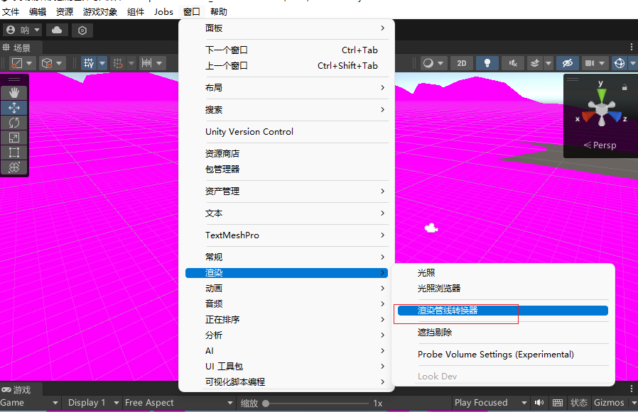

# BoatAttack 天气-水面联动系统

基于 Unity 的赛船游戏天气-水面物理仿真开发报告。

**时间跨度**: 2026.04.03 — 2026.05.31

---

## Demo 演示


---

## 时间线

### 4.3 — 4.15 | 仿真交互控制学习（StartUI 模块）

基于团结引擎 1.8.4 学习 UI 与物理脚本的联动控制：

**权限控制逻辑** — `UIController.cs` 在系统初始阶段禁用 `BoatControlSimple.cs` 动力脚本，实现静默启动后等待用户触发。

**状态切换机制** — 用户点击 `Start` 按钮后，UI 淡出，`BoatControlSimple.cs` 激活，WASD 物理控制接管。完整掌握了：
```
UI 触发 → 脚本状态管理 → 物理引擎激活 → 用户操控
```

---

### 4.16 — 5.10 | Phase 1: Crest Ocean + HDRP（已放弃）

- **引擎**: 团结引擎 1.8.4 + HDRP
- **方案**: Crest Ocean System 开源海洋插件
- **结果**: Shader 编译失败，水面材质全局呈死粉色



#### 已完成的环境部署

| 组件 | 版本 | 说明 |
|------|------|------|
| Burst Compiler | 1.8.26 | 高并发物理计算后端 |
| Mathematics | 1.2.6 | 向量与矩阵运算 |
| Shader Graph | 14.1.0 | HDRP 着色器编译支撑 |

#### 阻塞点排查

1. **全局配置冲突** — 初期误将外层 `ProjectSettings` 导入导致引擎锁死，清理后通过精准提取 `crest/Assets/Crest/Crest` 解决。

2. **Crest 菜单缺失** — 手动拖入源码缺少 `package.json`，引擎未识别为 Editor 插件。

3. **着色器全线飘红** — 核心 Shader 与团结引擎 HDRP 底层不兼容：
   - `Ocean.mat` 材质球预览即损坏
   - `OceanRenderer` 持续抛出 `RegisterAnimWavesInput` 验证错误
   - HDRP Wizard 强制转换无效

**结论**: 该版本 Crest 源码无法在当前管线下编译，项目挂起。转入替代方案。

---

### 5.10 — 5.31 | Phase 2: verasl water-system + URP（当前方案）

转向 **BoatAttack** 项目（Unity 6000.4.7f1 + URP），使用内置 `com.verasl.water-system` Gerstner 波浪系统，自建 `WeatherManager` 实现天气-水面联动。

#### 修改文件

| 文件 | 路径 | 改动 |
|------|------|------|
| `WeatherManager.cs` | `Assets/WeatherSystem/` | WaterPreset 系统 + 5 套天气参数 + 键盘切换 + null 安全 |
| `Water.cs` | `Packages/com.verasl.water-system/Scripts/` | Blitter 崩溃修复 + NonSerialized 序列化修复 + 物理同步 |
| `GerstnerWavesJobs.cs` | `Packages/com.verasl.water-system/Scripts/` | `UpdateWaveData(Wave[])` 运行时波浪热更新 |
| `Engine.cs` | `Assets/Scripts/Boat/` | 加速船头翘起扭矩降低 88% |
| `WaterSurfaceData.asset` | `Assets/Data/` | 手动修复被污染的序列化数值 |

#### 天气水面参数

| 按键 | 天气 | 波幅 | 波长 | 波浪数 | 可见度 | 泡沫 | 水面色调 |
|:---:|------|-----:|-----:|------:|------:|-----:|----------|
| **1** | ☀️ Sunny | 0.3m | 10m | 3 | 15m | 0.3 | 清澈蓝绿 |
| **2** | ☁️ Cloudy | 0.6m | 6m | 5 | 10m | 0.8 | 灰蓝 |
| **3** | 🌧️ Rainy | 1.0m | 6m | 5 | 6m | 2.0 | 暗灰蓝 |
| **4** | 🌫️ Foggy | 0.2m | 12m | 2 | 3m | 0.1 | 浑浊灰绿 |
| **5** | ⛈️ Thunderstorm | 1.5m | 5m | 7 | 3m | 1.5 | 暗蓝黑 |
| **Space** | 🔄 循环 | — | — | — | — | — | 依次切换 |

---

#### 关键技术攻关

##### 1. WaterPreset 运行时水面修改

```csharp
[Serializable]
public class WaterPreset
{
    public float waveAmplitude, waveDirection, waveLength;
    public int numWaves;
    public Color shallowWaterColor, deepWaterColor, scatterColor;
    public float waterVisibility, foamIntensity;
}
```

`ApplyWaterPreset()` 运行时修改 `WaterSurfaceData` ScriptableObject：
- 波形参数（振幅/波长/方向/波数）
- 吸收散射颜色渐变（`CreateWaterColorRamp` / `CreateScatterRamp`）
- 泡沫曲线（`AnimationCurve.EaseInOut` + `foamType = 1`）
- 调用 `UpdateSurfaceData()` 刷新 Shader 全局变量

##### 2. 物理波浪同步（最难点）

**问题**: `GerstnerWavesJobs.Init()` 启动时复制 `_waves` 到 NativeArray，此后波浪变化不传递给物理系统 → 船只浮力在所有天气下晃动相同。

**排查过程**:
```
✗ UpdateWaveData() 读取 Water.Instance → OnEnable 时 Instance 为 null → NullReferenceException
✗ Water._waves 带 [SerializeField] → Unity 序列化不断恢复初始值 → 覆盖新生成的波浪
✗ 24,000+ 次 Blitter 异常 → 日志 84MB → 渲染管线崩溃 → 画面黑屏
```

**修复**:
```csharp
// Water.cs — [System.NonSerialized] 替代 [SerializeField]
[System.NonSerialized]
public Wave[] _waves;

// GerstnerWavesJobs.cs — 直接传入波浪数组，不依赖单例
public static void UpdateWaveData(Wave[] waves)
{
    if (waves == null || waves.Length == 0) return;
    _waterHeightHandle.Complete();
    if (_waveData.IsCreated) _waveData.Dispose();
    _waveCount = waves.Length;
    _waveData = new NativeArray<Wave>(_waveCount, Allocator.Persistent);
    for (var i = 0; i < _waveCount; i++)
        _waveData[i] = waves[i];
}

// Water.cs — SetWaves 生成波浪后立即同步
GerstnerWavesJobs.UpdateWaveData(_waves);
```

##### 3. Editor Blitter 崩溃

```csharp
// CaptureDepthMap 仅在 Play 模式执行
if (Application.platform != RuntimePlatform.WebGLPlayer && Application.isPlaying)
    CaptureDepthMap();
```

##### 4. 船头翘起优化

```csharp
// Engine.cs — 加速度扭力: 1.0 → 0.12 (降低 88%)
RB.AddRelativeTorque(-Vector3.right * modifier * 0.12f, ForceMode.Acceleration);
```

##### 5. 键盘切换（Input System）

```csharp
if (Keyboard.current.digit1Key.wasPressedThisFrame) SetWeather(WeatherType.Sunny);
if (Keyboard.current.spaceKey.wasPressedThisFrame)  CycleWeather();
```

---

#### 使用方法

1. 进入 Play 模式
2. 按 **1-5** 跳转天气，**空格** 循环切换
3. Console 日志示例：
   ```
   水面已更新: 波幅=1.5, 波长=5, 波浪数=7, 可见度=3, 泡沫=1.5
   GerstnerWavesJobs 已更新: 7波, 总振幅=9.69m
   ```

---

## 技术栈

| 层 | 组件 |
|----|------|
| 引擎 | Unity 6000.4.7f1 / 团结引擎 1.8.4 |
| 渲染 | URP / HDRP |
| 水面 | com.verasl.water-system (Gerstner) / Crest Ocean |
| 输入 | Unity Input System |
| 物理 | Jobs + Burst |
| 天气 | 自建 WeatherManager + Volume 后处理 |

---

## 注意事项

- `Packages/` 下文件需**完全重启 Unity** 才生效
- 运行时修改的 ScriptableObject 退出 Play 后可能被持久化，已通过 YAML 重置 + `Mathf.Min(numWaves, 10)` 保护
- GIF 文件建议压缩到 10MB 以下：
  ```
  ffmpeg -i input.mp4 -vf "fps=10,scale=800:-1:flags=lanczos" -loop 0 output.gif
  ```
