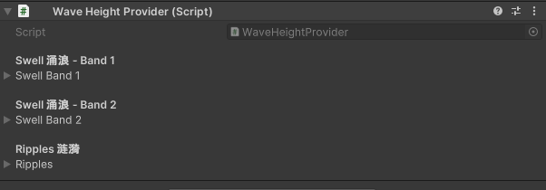
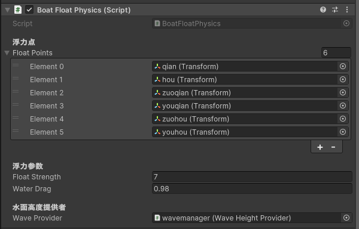
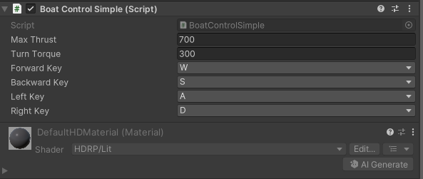

# 4.3
我试着下载boat attack这个项目，在团结引擎上运行，一开始直接下载.zip文件，水的颜色是紫色，并且没有水体的效果，在下载GitLFS后用git bash下载项目也没有效果,可能是团结引擎版本的原因

后来想用crest这个插件来更方便的实现船的浮力的计算，但也有问题

### 简单实现
通过HDRP水系统创建海洋，水面位置设为 Y=0。创建了一个立方体作为船，为船体添加 Rigidbody，设置质量、阻力等参数。在船底创建多个空物体作为浮力点。编写三个脚本：波浪来源、浮力计算与移动控制。在场景中挂载波浪来源，将船体上的浮力脚本和控制脚本配置好，拖入浮力点数组并引用波浪管理器。运行后根据浮沉情况微调浮力强度、推力与阻力。
### WaveHeightProvider
- 通过叠加波，模拟海洋环境

### BoatFloatPhysics
- 遍历浮力点，采样高度并施加浮力

### BoatControlSimple
- 读取 WASD 输入，施加推力与扭矩

