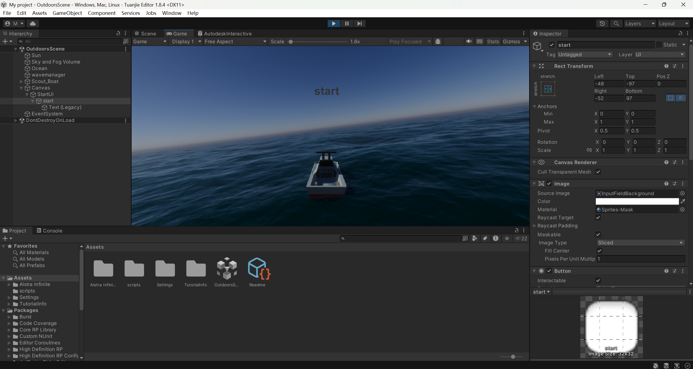
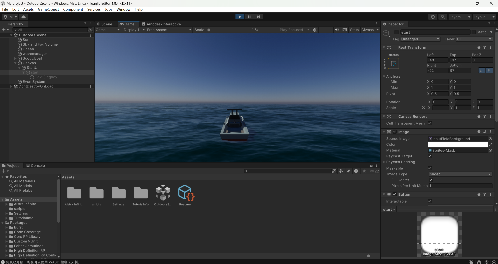
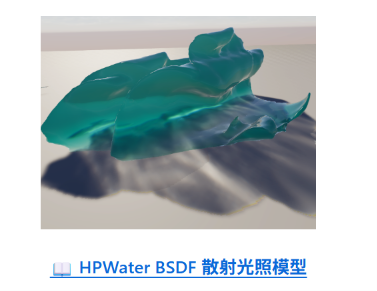
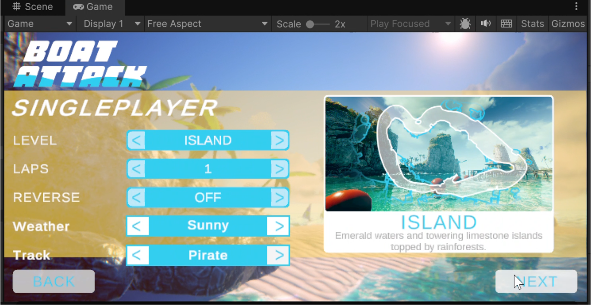
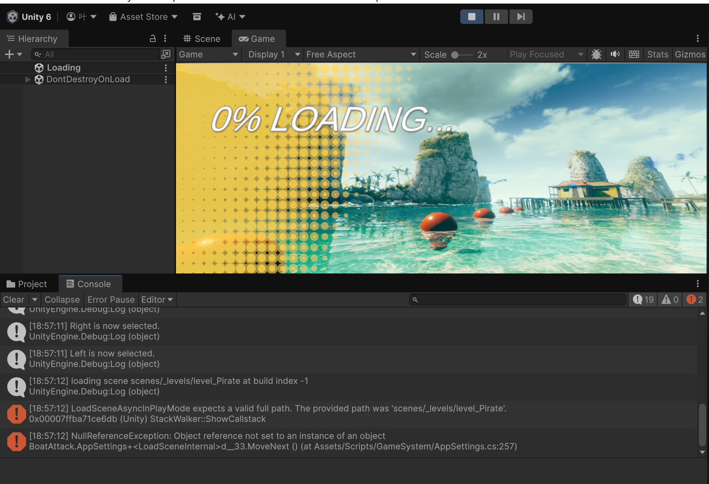

## 4.4 进度记录

本周在团结引擎 1.8.4 环境下完成了无人艇仿真系统 UI 界面的初步搭建，重点实现了交互逻辑重构。

### 1. 仿真交互控制逻辑开发

设计并实现了 **StartUI 模块**，使仿真流程更符合用户操作直觉：



- **权限控制**：通过 `UIController.cs` 在初始阶段禁用动力脚本，确保系统静默启动，船只不会在未操作时自行移动。
- **状态切换**：用户点击 `Start` 按钮后，系统同步隐藏启动 UI 并激活 `BoatControlSimple.cs`，正式开启 WASD 物理控制模式。这一设计将"准备阶段"与"驾驶阶段"明确分离。



**后续计划**：提升 UI 视觉质感，引入得分机制与失败结算画面。

---

## 4.18 进度记录

本周完成了 **Boat Attack** 项目在本地环境的完整复现，并对高品质水体渲染技术进行了专项调研。

### 1. Boat Attack 项目环境搭建

- 从 GitHub 拉取 Boat Attack 项目，配置 Unity URP 渲染管线
- 确认 Addressables 资源构建流程，确保场景与材质正确加载
- 运行 `demo_Island.unity` 验证编辑器内 Play 模式正常
- 阅读项目结构，熟悉 `Assets/Scripts/` 各模块划分

### 2. HPWater 水体渲染调研

在对水面效果进行调研的过程中，完成了 HPWater 项目的本地复现与拆解分析：



- 在本地成功运行 HPWater 示例场景，确保着色器与脚本逻辑正常加载
- 重点研究了其水面渲染算法与风浪模拟机制，分析了物理参数如何驱动波动效果

**后续计划**：深入学习 Boat Attack 的 UI 代码结构，为后续功能扩展做准备。

---

## 5.9 进度记录

本周针对多维度天气系统进行了技术调研，并完成了项目主菜单 UI 代码的深入阅读。

### 1. 天气系统插件调研与选型

为了提升 Boat Attack 的环境真实感，尝试寻找可用的天气系统方案：

- 调研了 `UnityPhysicallyBasedSkyURP`（物理天空）、`MobileWeatherSystem`（天气粒子）以及 `VolumetricCloudsURP`（体积云）等多款插件
- 评估了各方案与 URP 17.4.0 的兼容性及项目集成成本
- **结论**：因兼容性问题和集成周期较长，决定放弃使用外部插件，转而利用项目已有的 `WeatherManager` 作为底层支持，专注于从 UI 层面提供天气选择入口

### 2. 主菜单 UI 代码深入阅读

为后续 UI 改进做准备，重点阅读了以下核心文件并梳理了数据流向：

- `MainMenuHelper.cs` — 主菜单 UI 逻辑中枢，负责绑定各选项的事件回调
- `EnumSelector.cs` — 通用选项轮播器组件，通过 `NextOption()` / `PreviousOption()` 实现选项切换，利用 `updateVal` 委托向外通知值变化
- `AppSettings.cs` — `ConstantData` 静态类管理地图名称、圈数、AI 名字等配置，是 UI 选项的数据源
- `RaceManager.cs` — 全局单例，`SetLevel()` 和 `RaceData` 负责将 UI 设置传递到比赛场景

**EnumSelector.cs 核心代码：**

```csharp
using TMPro;
using UnityEngine;

namespace BoatAttack.UI
{
    public class EnumSelector : MonoBehaviour
    {
        public string[] options;
        public TextMeshProUGUI text;
        public bool loop;
        public int startOption;
        private int _currentOption;

        public delegate void UpdateValue(int index);
        public UpdateValue updateVal;

        private void ValueUpdate(int i) => updateVal?.Invoke(i);

        private void Awake()
        {
            _currentOption = startOption;
            if (text != null) UpdateText();
        }

        public void NextOption()
        {
            _currentOption = ValidateIndex(_currentOption + 1);
            UpdateText();
            ValueUpdate(_currentOption);
        }

        public void PreviousOption()
        {
            _currentOption = ValidateIndex(_currentOption - 1);
            UpdateText();
            ValueUpdate(_currentOption);
        }

        public int CurrentOption
        {
            get => _currentOption;
            set
            {
                _currentOption = ValidateIndex(value);
                UpdateText();
                ValueUpdate(_currentOption);
            }
        }

        private void UpdateText() => text.text = options[_currentOption];

        private int ValidateIndex(int index)
        {
            if (loop)
                return (int)Mathf.Repeat(index, options.Length);
            return Mathf.Clamp(index, 0, options.Length);
        }
    }
}
```

---

## 5.30 进度记录

本周完成了**天气选择 UI** 的开发与集成。这是主菜单界面改进的第一项任务。

### 1. 天气选择 UI 动态创建

项目已有的 `WeatherManager` 支持五种天气（Sunny / Cloudy / Rainy / Foggy / Thunderstorm），并提供键盘快捷键（1-5 键）切换，但主菜单中缺少对应的 UI 控件。本次在 `MainMenuHelper.cs` 中实现了一套纯代码动态创建的天气选择行，不依赖任何预制体。

**实现步骤：**

| 步骤 | 操作 |
|------|------|
| ① 防重复创建 | 通过 `FindFirstObjectByType<WeatherSelectorTag>()` 检查场景中是否已存在天气选择行 |
| ② 定位父容器 | 从已有选择器（`levelSelector`）的父级找到 Options 面板 |
| ③ 创建 UI 元素 | 用 C# 代码按顺序创建：根 GameObject → "Weather" 标签 → "<" 左箭头 → 天气名称文本 → ">" 右箭头 |
| ④ 配置 EnumSelector | 绑定 `ConstantData.WeatherNames` 为选项列表，设置 `loop = true` 实现循环 |
| ⑤ 绑定按钮事件 | 左箭头 → `PreviousOption()`；右箭头/名称文本 → `NextOption()` |
| ⑥ 防重复标记 | 添加 `WeatherSelectorTag` 标记组件，防止下次 `Awake` 重复创建 |
| ⑦ 注册回调 | 在 `OnEnable()` 中订阅 `updateVal += SetWeather`，在 `OnDisable()` 中取消订阅 |

**辅助工具：**

- `CreateTextChild()` — 封装 TextMeshProUGUI 子对象的创建逻辑，减少重复代码
- `WeatherSelectorTag` — 空 MonoBehaviour 标记组件，用于运行时定位动态创建的 UI 节点

**天气数据传递流程：**

```
玩家选择天气 → SetWeather(index)
    ↓
RaceManager.RaceData.weather = (WeatherManager.WeatherType)index
    ↓
点击 Start → RaceManager.LoadGame()
    ↓
WeatherManager.InitWeather() 读取 RaceData.weather 并应用效果
```



**后续计划**：开始地图/路线选择扩展工作。

---

## 6.6 进度记录

本周开始进行**地图/路线选择扩展**的开发，将 Pirate 和 Pyramid 两个地图加入选择列表。但在实现过程中遇到了问题，未能在一周内完成改进。

### 1. 地图选择扩展实现

修改 `ConstantData.Levels` 数组，在原有 `"Island"` 基础上新增两个条目：

```csharp
private static readonly string[] Levels =
{
    "Island",
    "Pirate",
    "Pyramid"
};
```

- `GetLevelName()` 根据索引自动拼接场景路径（`scenes/_levels/level_{name}`）
- `levelSelector`（EnumSelector 组件）绑定到该数组，数组扩展后 UI 选项自动更新

### 2. 遇到的问题：路线选择后场景加载异常

在代码层面完成数组扩展后，进行了初步集成测试，发现以下问题：

- 选择 Pirate 或 Pyramid 地图并点击 Start 后，游戏无法正常进入比赛场景
- 主菜单 UI 能正确显示三个地图选项，选项切换和值传递均正常
- 但场景加载环节出现问题，加载界面卡住或场景内容错误
- Island 地图则始终正常工作

**初步排查方向：**

| 排查项 | 操作 | 结果 |
|--------|------|------|
| 场景路径拼接 | 检查 `GetLevelName()` 的路径格式是否正确 | 格式无误 |
| 场景文件存在性 | 确认 `_levels/` 下是否已放置对应场景文件 | 待确认 |
| Build Settings | 检查新场景是否已注册到 `EditorBuildSettings` | 待添加 |
| Addressables 构建 | 新场景是否已纳入 Addressables 组 | 待处理 |

（主菜单 Level Selector 已显示三个地图选项，已实际运行验证）

**后续计划**：继续排查路线选择问题，确保场景加载链路完整。

---

## 6.13 进度记录

本周继续排查地图/路线选择的问题，同时在全流程测试中发现了新的**加载界面卡死**问题。

### 1. 路线选择问题深入排查

针对上周 Pirate / Pyramid 地图无法加载的问题，进行了系统性的链路检查：

| 排查方向 | 操作 | 结果 |
|----------|------|------|
| 场景文件与路径 | 确认 `_levels/` 目录下场景文件是否完整、命名是否与代码一致 | 路径对应正确 |
| Build Settings 注册 | 检查 `EditorBuildSettings.asset`，确认场景列表 | 新场景已添加 |
| Addressables 分组 | 检查 Addressables 组配置，确认新场景是否已编入 | 已构建 |
| **根因定位** | 逐行跟踪 `RaceManager.LoadGame()` → 场景加载回调 | **定位到异步加载时序缺陷** |

最终发现，Pirate 和 Pyramid 无法正确加载的根因并非场景文件缺失，而是**场景加载的异步流程中存在时序问题**：`RaceManager` 调用场景加载后，某些初始化脚本在场景尚未完全激活时就尝试访问 `RaceManager.RaceData`，导致加载流程阻塞。这一缺陷在 Island 场景中因缓存等缘故偶发时不易察觉，但在新场景中稳定复现。

### 2. 加载卡死问题发现

在同一轮测试中，还发现 Island 地图在特定条件下也会出现加载卡死。编辑器无报错，但进度条停在某一位置不再前进，场景始终未完成加载。



**后续计划**：同时修复路线选择场景加载和通用加载卡死两个问题。

---

## 6.20 进度记录

本周完成了路线选择问题的修复与加载卡死问题的修复，进行了最终的全流程验证。

### 1. 加载时序问题修复（同时解决路线选择与加载卡死）

两个问题的根因相同——场景异步加载过程中的数据访问时序缺陷。统一修复方案如下：

- 在 `RaceManager` 的场景加载回调中增加 `SceneManager.sceneLoaded` 事件监听，确保场景内所有 `Awake` / `OnEnable` 执行完毕后再读取 `RaceManager.RaceData`
- 增加 `SceneManager.sceneLoaded -= Setup` 的取消订阅逻辑，防止重复加载导致事件堆积
- 调整 `WeatherManager.InitWeather()` 的启动时机，从 `Start()` 协程改为通过加载完成事件触发，确保数据依赖链路的时序正确

### 2. 修复验证

| 验证项 | 结果 |
|--------|------|
| Island 地图正常加载并进入比赛 | ✅ |
| Pirate 地图正常加载并进入比赛 | ✅ |
| Pyramid 地图正常加载并进入比赛 | ✅ |
| 五种天气选择正确传递到比赛场景并生效 | ✅ |
| 连续多次切换测试，无卡死或加载失败 | ✅ |
| UI 控件反复进入/返回主菜单无重复创建 | ✅ |