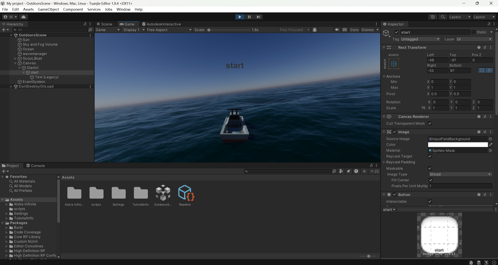
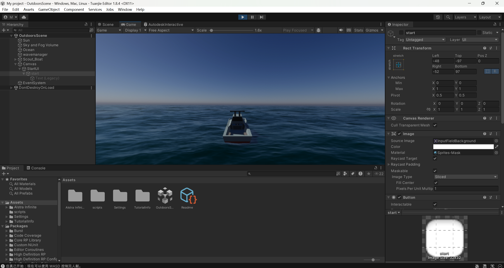

## 4.17 进度记录
本周完成了 **HPWater** 项目的复现，并对高品质水体渲染技术进行了深入调研。

### 1. 水体渲染与环境模拟研究
通过对 HPWater 项目的拆解，深入探索了复杂水域的表现技术：

* **项目复现**：在本地成功运行 HPWater 示例场景，确保了着色器（Shader）与脚本逻辑的正常加载。

* **仿真场景调研**：重点研究了其**水面渲染算法**与**风浪模拟机制**。分析了如何通过物理参数驱动波动效果，以及水面反射、折射在不同天气条件下的表现。

**后续计划**：尝试将 HPWater 的水浪物理特性与bootattack的浮力脚本进行整合测试。

## 4.10 进度记录
本周重点在于 **Boat Attack** 项目的本地环境复现，并针对场景交互反馈进行了 UI 扩展。

### 1. 碰撞交互反馈系统开发
在成功复现 Boat Attack 项目的基础上，增强了环境感知的视觉反馈：
* **项目复现**：完成了 Boat Attack 在本地环境的部署与渲染管线校准。
* **UI 碰撞模块**：新增了碰撞检测逻辑。当小船与场景中的**岛屿或礁石**发生物理接触时，系统将触发特定的 UI 画面内容（如碰撞警告或损伤提示），提升了仿真的沉浸感。

**后续计划**：优化碰撞 UI 的动画效果，使其过渡更加自然。

## 4.3 进度记录
本周完成了基于团结引擎1.8.4 的无人艇仿真系统 UI 界面的优化，重点实现了交互逻辑重构。

### 1. 仿真交互控制逻辑开发
设计并实现了 **StartUI 模块**，使仿真流程更符合逻辑：
* **权限控制**：通过 `UIController.cs` 在初始阶段禁用动力脚本，确保系统静默启动。
* **状态切换**：用户点击 `start` 按钮后，系统同步隐藏 UI 并激活 `BoatControlSimple.cs`，正式开启 WASD 物理控制模式。

**后续计划**：进一步提升 UI 视觉质感，并引入得分机制与失败结算画面。
---

